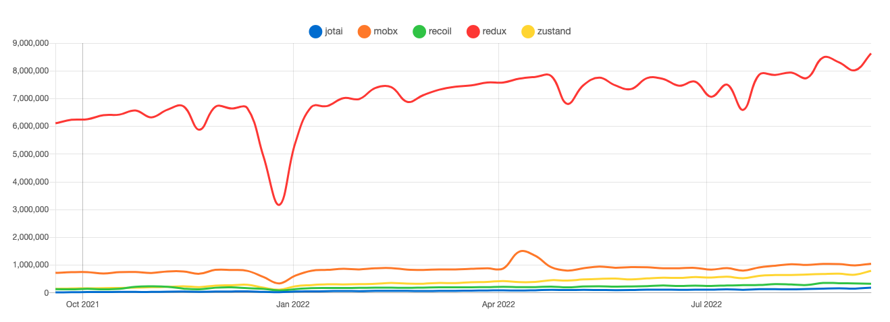
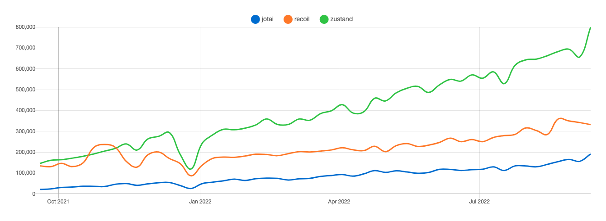
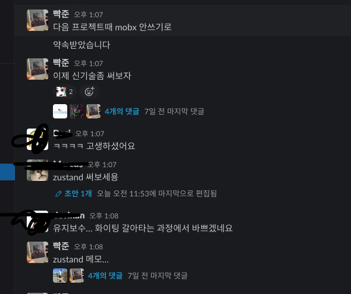
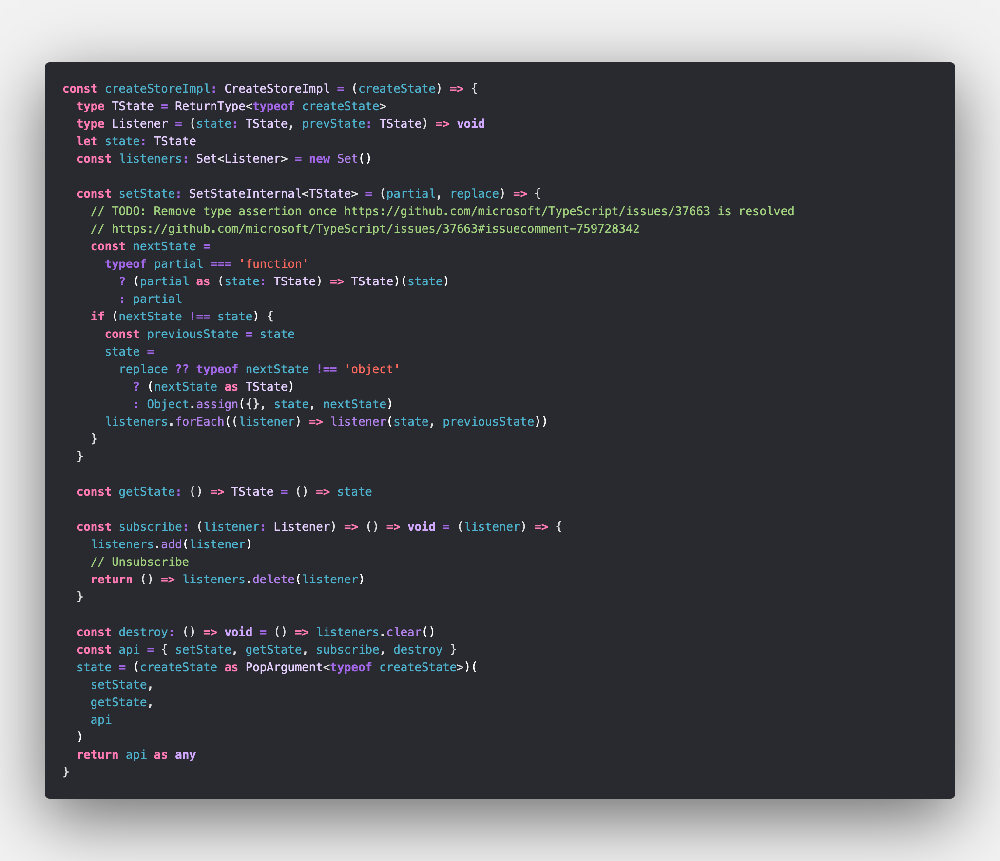

Redux, Mobx에 질려버린 사람들이 요즘은 아토믹한 전역상태관리 라이브러리를 많이 사용하려고 옮겨가는것같다.
가장 유명한 세가지 `recoil`, `zustand`, `jotai`이다 (물론 아직도 redux가 압도적으로 생태계를 지배하고있기는 하다.)



하지만 `recoil`, `zustand`, `jotai`로만 순위를 매겼을때에는 zustand가 무섭게 치고올라고있다.


다음 사내 프로젝트에 들어갈 라이브러리 탐색을 하고있던 찰나 노마드코더 커뮤니티에서 zustand를 추천받았다!



## [zustand](https://github.com/pmndrs/zustand)

정말 간단한 예로 로그인 상태관리를 해보겠다.

zustand의 스토어는 hooks의 형태다.
hook에는 primitives(원시값), 객체, 그리고 함수도 선언할수있다.
state는 불변성을 가지며 set 함수가 해당 state를 [merge](https://github.com/pmndrs/zustand/blob/main/docs/guides/immutable-state-and-merging.md)시키게 도와준다

```js
import create from "zustand"

const useAuthStore = create(set => ({
  isLoggedIn: false,
  user: {},
  setLoggedIn: () => set(state => ({ isLoggedIn: true, user: state.user })),
  setLoggedOut: () => set(() => ({ isLoggedIn: false, user: {} })),
}))
```

이제 이 코드를 컴포넌트에 녹여내볼 차례다.

> 이제 어느 컴포넌트에서든 Provider없이 state를 선택하고 변화에 반응하게 될것이라고 한다.

아래 코드에서는 유저가 로그인했는지 안했는지 감지하고
로그인상태면 로그아웃을 유도하고 ??
로그아웃상태면 로그인을 유도하는?? 컴포넌트다

```jsx
function LoginPage() {
  const { isLoggedIn, setLoggedIn, setLoggedOut } = useAuthStore(state => state)
  if (isLoggedIn) {
    return (
      <div>
        <span>안녕하세요!</span>
        <button onClick={setLoggedOut}>로그아웃</button>
      </div>
    )
  } else {
    return (
      <div>
        <button onClick={setLoggedIn}>로그인</button>
      </div>
    )
  }
}
```

아주 놀랍게도 겨우 코드 7줄을 작성했는데 로그인전역상태관리가 되어버린다.
mobx... redux면 뭐 벌써부터 머리가 어질어질하긴하다.

redux면 뭐 디스패치... 유즈셀렉터... 작성할게 엄청나고<br/>
mobx면 authClass 에 observable state 선언하고... <br/>코드가 분명 7줄보다는 그 N배가 될수밖에 없다.

제일 신기한점이 Provider 없이 어떻게 상태를 감지할까였다. recoil찍먹당시 RecoilRoot Provider를 컴포넌트보다 상위 루트에 배치해야했었고 Mobx도 마찬가지였다.

알고보니 `zustand`는 매우 간단하게 Flux패턴을 따르는 상태 관리 라이브러리라고 소개된다.

### zustand 동작원리

zustand는 Sub/Pub 모델을 기반으로 이루어져있다.
스토어의 상태 변경이 일어날 때 실행할 Listener를 모아두었다가(Sub) 상태가 변경되었을때 등록된 Listener들에게 상태가 변경되었다고 알려준다(Pub)

**원본코드**


**상태변경**

먼저 `setState`부터 보겠다

이 함수는 prevState를 기반으로 nextState를 리턴하는 함수 혹은 변경하려는 state 값을 전달받는다.

```js
store.setState(state => ({ counter: state.counter + 1 }))
```

이런 동작을 구현하려면 `prevState`를 함수 파라미터로 전달하는 방법과 함수를 갱신하는 방법이 필요하다.
함수를 전달받게 된다면 `prevState`를 파라미터로 넘겨주는 식으로 `nextState`를 정의한다.

```js
const setState = (partial) => {
    const nextState = typeof partial === 'function' ? partial(state) : partial
    ...
}
```

이렇게 정의된 `nextState`가 기존 `state`와 다른경우 갱신한다. 갱신방법은 가장 효과적이고 간단한 `Object.assign`을 사용한다

```js
if (nextState !== state) {
  const prevState = state

  state = Object.assign({}, state, nextState)

  listeners.forEach(listener => listener(state, previousState))
}
```

`Object.assign`은 얕은 복사를 수행하는데 중첩된 형태의 스토어를 만들 경우 `setState`를 호출할때 유의해야한다

### 구독

state를 Subscription하는 함수를 등록할때는 `subscribe`함수를 사용한다.
모든 상태의 변화를 구독할수도있고, 일부만 구독할수도있다.

```js
const subscribe = (listener, selector, equalityFn) => {
  if (selector || equalityFn) {
    return subscribeWithSelector(listener, selector, equalityFn)
  }
  listeners.add(listener)

  return () => listeners.delete(listener)
}
```

만약 `listener`만 전달하지않고 두번째 인자로 함수의 셀렉터까지 전달한다면 셀렉터로 꺼낸 상태의 일부를 어딘가 보관하고 상태가 바뀔때마다 이전 슬라이스와 비교하는 과정이 필요하다.

```js
const subscribeWithSelector = (listener, selector, equalityFn = Object.is) => {
  let currentSlice = selector(state)

  function listenerToAdd() {
    const nextSlice = selector(state)
    if (!equalityFn(currentSlice, nextSlice)) {
      const previousSlice = currentSlice
      listener((currentSlice = nextSlice), previousSlice)
    }
  }

  listeners.add(listenerToAdd)
  return () => listeners.delete(listenerToAdd)
}
```

### 결과물

```js
const authStore = create(set => ({
  isLoggedIn: false,
  user: {},
  setLoggedIn: () => set((state) => ({ isLoggedIn: true , user: state.user})),
  setLoggedOut: () => set(() => ({ isLoggedIn: false, user: {} })),
}));

authStore.subscribe(state => console.log('Something's changed: , state));// 어떤 상태가 변경되더라도 로그가 출력됨
authStore.subscribe(
  state => console.log('isLoggedIn is changed: ', isLoggedIn),
  state => state.isLoggedIn
);

authStore.subscribe(
  state => console.log('user has been changed: ', user),
  state => state.user
);


authStore.setLoggedIn({user : { name:'BBAK-JUN' } }); // user객체와 isLogged의 상태 변경
```
