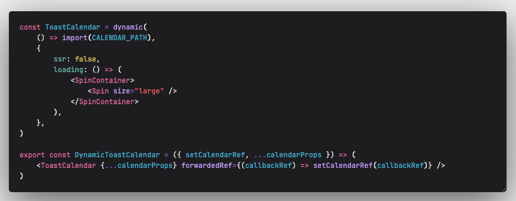
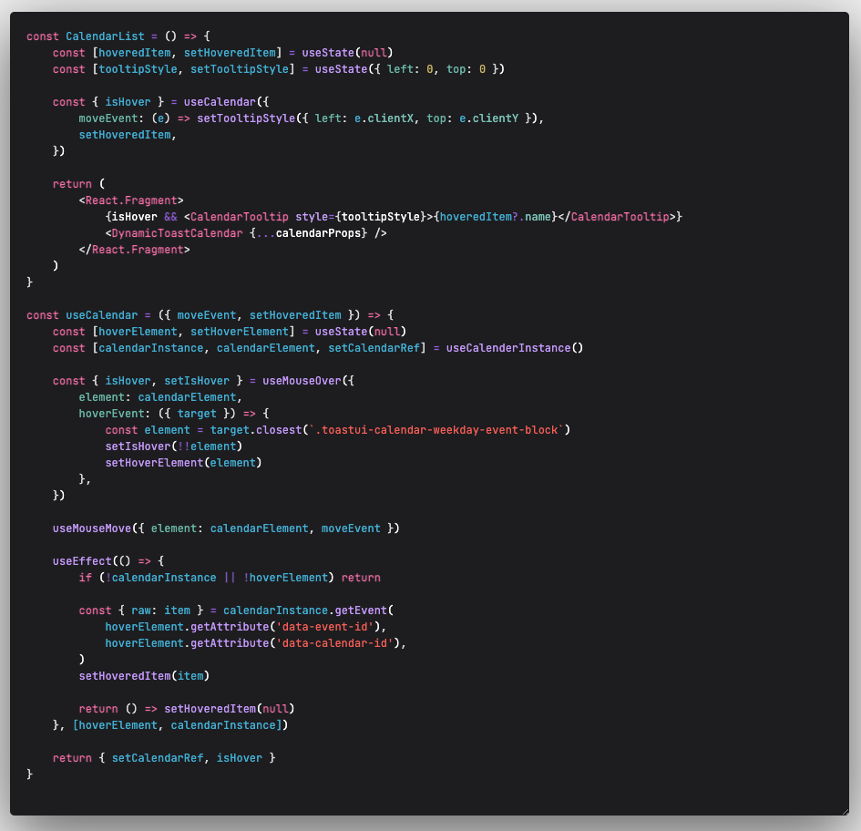

## Jun 유저경험 개선시켜보도록 하죠!

어느날 토스트캘린더가 적용된 컴포넌트에 **유저경험 개선**을 위해 캘린더에 마우스 호버를 했을때 해당요소의 Description을 툴팁박스에 띄워보자는 요구사항이 생겼다.

**개발자라면 주어진 업무를 어떻게든 해내야합니다.** 라고 내 이력서에 적혀있다.

당연하게 하려고 `how to add Mouse Hover Event on Toast Calendar`를 검색해보았고 아래 사진과같은 답변을 보게되었고 아찔해졌다.


오.. 내가 직접 구현해내야하는구나..

## 오히려 좋아?

생각해볼것은 아래의 요소들이었다.

- Dynamic Import로 불러온 Toast Calendar Instance를 어떻게 관리해야할까?
- Instance의 event로 등록된 캘린더 요소를 어떻게 찾아낼까?
- Hover Event등록과 MouseMove Event 등록으로 부드러운 이벤트를 어떻게 만들어야할까?

### Dynamic Import로 불러온 Toast Calendar Instance를 어떻게 관리해야할까?


토스트 캘린더의 특징중하나가 클라이언트사이드에서만 불러올수있다는 점이었다.

그냥 import 해올경우 `window is not defined.`라는 멋진 에러를 만나게 된다.

Next.JS로 서버사이드렌더링을 하니 Dynamic Import 을 사용해보자. 라고 호기롭게 작성해보니 ref를 확인해보았다.


ref.current은 null 이지만 lazy initialization이 되어 current가 ToastUIReactCalendar 인스턴스를 늦게 참조해온다는 사실을 알게되었다.

여기서 살짝 멘붕이왔었다. lazy initialization을 처음 경험해보기도했으며, 어떻게 대처를 해야할지 막막했던 탓에 이곳저곳 질문을 올려서 자문을 구했었다.


그 중 노마드코더의 Taeyoung님께서 callback Ref [공식문서](https://ko.reactjs.org/docs/refs-and-the-dom.html#callback-refs) [베타문서](https://beta.reactjs.org/reference/react-dom/components/common#ref-callback)를 사용해보는게 어떠세요? 라고 해주셨고 바로 찾아보았다.

#### ref callback function

callback Ref function 이란 ref 객체를 대신해 DOM요소 ref속성에 함수를 할당해주는 기능이다.

```jsx
<div ref={node => console.log(node)}>Hello</div>
```

`div` Dom 노드가 화면에 출력되었을 때, React는 Dom 노드를 매개변수로 받는 Callback Ref 함수를 호출한다.

`div` DOM 노드가 제거되었을때, React는 Callback Ref 함수를 null로 호출한다.

React는 다른 Callback Ref 함수를 전달할때마다 Callback Ref 함수를 호출한다. 위의 에에서 `(node) => console.log(node)` 는 모든 렌더링마다 다른 함수(메모리 참조가 다르므로)다. 따라서 구성 요소가 다시 렌더링될때 이전 함수는 인수로 null을 사용하여 호출되고 다음 함수는 DOM 노드로 호출된다.

- **Parameter node** : DOM Node or Null이다. React는 ref가 연결되면 Dom node를 연결하고, ref와 연결이 끊어지면 null이된다. 모든 렌더에서 Callback Ref 함수에 대해 동일한 기능 참조를 전달하지 않는 이상 구성 요소를 다시 렌더링하는동안 콜백이 일시적으로 분리되었다가 다시 연결된다.
- **Return** : 아무것도 반환하지않는다.

여기서 가장 주목해야할것이 이 부분이었다.

> DOM 노드가 화면에 출력되었을때 callback ref 함수를 호출한다.

콜백 ref 함수는 모든 렌더링마다 다른함수이므로 다른 파라미터를 가지고있다.

그렇다면 마운트 이후에 내 토스트 캘린더의 ref도 가지고있지않을까 했고 아래와 같은 결과도출이 나왔다.

마운트 당시에는 ref가 없을테고(lazy Loadable때문) 캘린더 컴포넌트 Dom Node가 생성된 후 callback Ref를 사용하여 해당 Dom Node를 state로 만들어 캘린더 인스턴스를 관리할수있게 해보자고 코드를 써내려가기 시작했다.





캘린더 인스턴스와 요소를 가지고있어야할 저장소가 필요해서 커스텀훅스로 분리했다.

- Dynamic import 해온 캘린더 컴포넌트
- Dynamic import 해온 캘린더 컴포넌트를 사용하는 컴포넌트
- Dynamic import 해온 캘린더 컴포넌트의 인스턴스를 찾아주는 커스텀훅스

이렇게 두가지로 분리하니, 현재는 하나의 페이지 컴포넌트에서 캘린더 인스턴스를 필요로 할수있어 위와 같이 세단계로 분리하여 작성하였다.

만약 인스턴스가 필요없다면 훅스 사용을 하지않고 캘린더 컴포넌트를 불러와 사용할수있기에 확장성있고 유연한 코드 작성이 되었던 시간이었다.

## 여기서 끝인가?

그럴리가 있겠는가?

캘린더 인스턴스를 왜 지니고 있어야하는가??는 **유저경험 개선**인 호버이벤트를 위한 작업이었다.


우선 호버이벤트와 무브이벤트를 사용할수있는 훅스를 제작하였다. 이제 이 훅스를 사용하기 위해 자료를 조사했다.


[Toast Calendar Event Object](https://github.com/nhn/tui.calendar/blob/main/docs/ko/apis/event-object.md) 공식문서다. 여기에 캘린더에 들어가야할 요소들을 정의하는 타입이 정의되어 있다.


[Toast Calendar getEvent Method](https://github.com/nhn/tui.calendar/blob/main/docs/ko/apis/calendar.md#getevent)

내가 캘린더에 넣어준 요소를 찾아낼수있는 메서드다.

이 메서드에서 나는 `id`, `calendarId`가 필요하다는 사실을 알게되었고, 조금만 더하면 기능이 완성된다는 생각에 기뻤다.

그렇게 개발자도구를 켜보고 혹시 요소중에 id와 calendarId를 가진 요소가 없을까? 생각하며 뒤적뒤적.. 찾아보았고.. 마침내 찾았다!

`toastui-calendar-weekday-event-block` 클래스명을 가진 요소에 모두 갖고있었다.



그렇게 해당 id와 calendarId를 가진 요소를 만나면 `isHover` 상태변경 트리거하는 로직을 작성해서 Next.js 환경에서 Toast Calendar 에 커스텀 이벤트를 붙이는 작업을 완성해냈다.

<p align="center">

</p>

이력서에 적혀있듯 **개발자라면 주어진 업무를 어떻게든 해내야합니다.** 에 다가갈수있던 뜻깊은 작업이었다.
