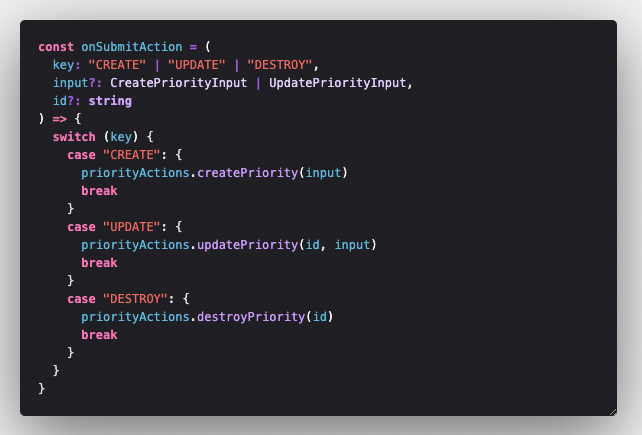
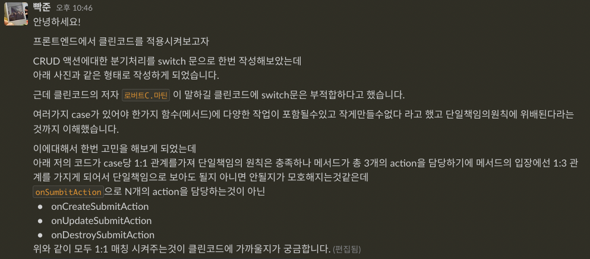
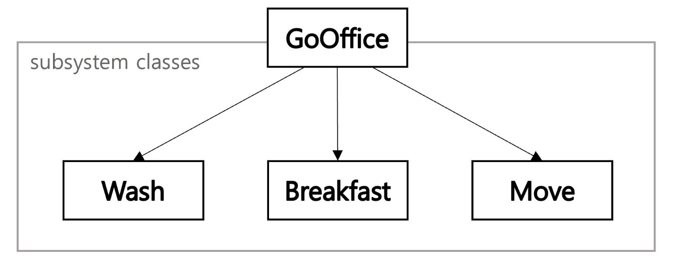

사내 백오피스 개발을 진행하며 특정도메인에 대한 CRUD로직이 한 페이지내에서

-   create Modal
-   update Modal
-   destroy Modal

로 액션이 나뉘게 되었다.

그러면서 나는 모달의 visible 상태를 하나하나 관리했었다

```js
const [createModalVisible, setCreateModalVisible] = useState(false)
const [updateModalVisible, setUpdateModalVisible] = useState(false)
const [destroyModalVisible, setDestroyModalVisible] = useState(false)
```

하지만 위의 코드를 보고있자니 뭔가 불편했다. 관심사도 같고 원시값의 state들이라 아래와 같은 생각을 하게되었는데

> 아 관심사가 같고 모두 boolean 값을 가지는데 하나의 객체로 묶어서 관리하면 어떨까?

바로 코드로 작성해보았다.

```js
const [modalVisible, setModalVisible] = useState({
	CREATE: false,
	UPDATE: false,
	DESTROY: false,
})
```

`setModalVisible` 이라는 `setStateAction`은 modal의 visible의 상태를 변경해주는 메서드(함수)가 되었다.

위와같이 작성해주니 모달의 열림과 닫힘의 액션발생지점도 변경되었는데,

```js
<button onClick={() => setCreateModalVisible(true)}>추가하기</button>
<button onClick={() => setUpdateModalVisible(true)}>수정하기</button>
<button onClick={() => setDestroyModalVisible(true)}>삭제하기</button>
```

```js
<button
  onClick={() => setModalVisible((prevVisible) => ({...prevVisible, CREATE : true}))}>
  추가하기
  </button>
<button
  onClick={() => setModalVisible((prevVisible) => ({...prevVisible, UPDATE : true}))}>
  수정하기
  </button>
<button
  onClick={() => setModalVisible((prevVisible) => ({...prevVisible, DESTROY : true}))}>
  삭제하기
</button>
```

아래와 같이 변경되게 되었다. 하지만 난 jsx내부에서 함수를 보여주는게 싫고, 코드가 더러워보인다.
나는 페이지 컴포넌트 소스파일을 열었을때에

> 해당 소스내에서 적어도 아~~ 이런 액션이 발생하는구나??

라는 생각을 코드로 명시적으로 보여주는것이 좋다고 생각한다.

그래서 코드를 조금 변형시켜보았다.

```js
const onOpenModalAction = (key) => {
	switch (key) {
		case 'CREATE': {
			setModalVisible((prevVisible) => ({ ...prevVisible, [key]: true }))
			break
		}
		case 'UPDATE': {
			setModalVisible((prevVisible) => ({ ...prevVisible, [key]: true }))
			break
		}
		case 'DESTROY': {
			setModalVisible((prevVisible) => ({ ...prevVisible, [key]: true }))
			break
		}
	}
}

const onCloseModalAction = (key) => {
	switch (key) {
		case 'CREATE': {
			setModalVisible((prevVisible) => ({ ...prevVisible, [key]: false }))
			break
		}
		case 'UPDATE': {
			setModalVisible((prevVisible) => ({ ...prevVisible, [key]: false }))
			break
		}
		case 'DESTROY': {
			setModalVisible((prevVisible) => ({ ...prevVisible, [key]: false }))
			break
		}
	}
}
```

그렇게 작성해보니 아래와 같은 고민에 빠지게 되었는데...

> 그럼 modal form들의 submitAction도 분기처리를 해주는게 좋을까??

라고 생각이 들자마자 한번 바로 작성하였다.



물론 이코드는 최하단에 존재하는 View Layer의 코드다.

사내 프로젝트의 데이터흐름은 단방향으로<br/>
View -> ViewModel -> Model -> Service(data fetch Layer)<br/>
Service -> Model -> ViewModel -> View

요렇게 흐른다

뷰모델레이어, 모델레이어, 서비스레이어는 모두 한 메서드가 하나의 역할만을 하고있다.<br/>

get , set , fetch , create , update , destroy ... 등등 많은 메서드들이 존재하지만,<br/>
모두 `SRP(단일책임의 원칙)`을 충족하고있다.

View Layer에는 사용자의 액션에 따른 User InterAction이 발생하는 지점이자,<br/>
Model Layer에서 사용자에게 필요한 정보를 보여줘야하는 지점이기도하다.

페이지 컴포넌트 내에서 존재하는 localState인 modalVisible을 담당하는
`onOpenModalAction , onCloseModalAction` 메서드와 global State를 조작하는 `onSubmitAction`의 무게는 다르지않을까 라는 생각을 해보게되었다.

두 함수 둘다 key값에 의해서 분기처리가 동일하게 진행되고있다.

가독성은 좋아보였다. 왜냐면 onSubmitAction 이라는 함수가 실행될때 아 액션은 총 3가지구나 라는것이 한눈에 들어오니까 말이다.

하지만 클린코드의 저자 `로버트 C.마틴`은 클린코드에서 switch는 피하라고 말씀하셨고, <br/>
생각해보니 단일책임의 원칙도 지키지 못하는 코드같아 노마드코더 `react` 채널에 질문을 올렸었다.



총 3분이 답장해주셨고 클린코드로 작성하려면 모든 메서드들을 분리하느게 맞다... 라고 답변해주셨다.

내가 작성한 코드가 더럽다!!!라는 생각에 잠깐 충격적이긴 했지만, 코드를 작성할때 SOLID원칙을 충족하며 가독성이 좋은코드를 작성하는게 중요하다는것도 느꼈다.

대학교 친구에게도 한번 질문했었다.

내코드가 SOLID원칙을 충족하지 못하는것같다. 하지만 코드 가독성은 좋은것같은데 이렇게 작성하는게 맞을까? 라고 질문했다.

친구의 답변은

> SOLID원칙은 메서드 단위만 보고 작성하는게 아니다. 클래스가 무슨일을 하는지 다 알아야 논할수있고 해당컴포넌트의 역할이 가장 중요하다. 지금 작성한 함수는 모델레이어에게 넘겨주기전에 앞에서 `퍼사드 역할`하는것일뿐이다. 너무 패턴에 얽매일 필요 ㄴㄴ 중간에 분기처리를 하는 레이어를 추가해서 페이지컴포넌트의 분기처리 책임을 옮기던, 다형성을 이용해서 이벤트 처리 책임을 가지는 객체를 반환하던 방법은 매우많다. 근데 당장 가독성에 지장이없다면 그냥 냅둬도된다. 후에 좀 아니다싶으면 리팩토링할수도있는거다. 초기 코드에서 후일을 모두 도모할수는 없는거니까

라고 말해주었다.

놀라웠다. 나는 간단한 CRUD 분기처리를 하는데 함수의 관점에서만 SOLID원칙을 생각하고있던것이었다. OOP관점에서 볼때 클래스(컴포넌트)의 역할이 더 중요하다는것을 망각하고 있었던것이었고, 추가로 퍼사드 패턴이라는것을 알게되었다.

간단하게 **퍼사드 패턴**을 설명하자면

사용자의 요청을 서브시스템 객체에 전달하는 단순하고 일관된 통합 인터페이스 라고 보면된다.<br/>
서브시스템 객체는 퍼사드에 대한 정보를 가지지 않고 서브시스템의 기능을 구현하는 클래스라고 보면된다.



<hr />

> **결론**

##### 알잘딱하게 코드 작성하자

결국 개발자도 사람이고 모든 경우에 대해서 초기부터 대응하려고 하면 실수가 생기기 마련이며, 오버엔지니어링이라는 생각을 하게되었다.

물론 적당히 유연하게 대응할수있는 코드를 작성하겠지만, 과추상화하는 코드를 지양해야겠다고 생각하게된 경험이었다.
