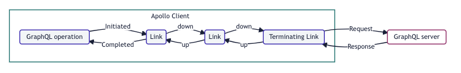
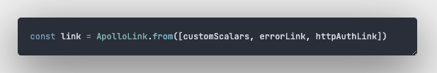
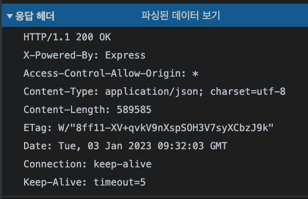
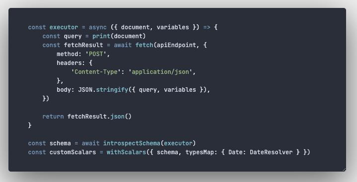
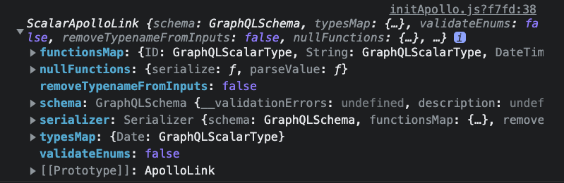

# 문제 원인

## 버그와의 첫만남

> 인트라넷 QA테스트 도중, 날짜 선택후 저장하면 저장되는 날짜가 하루씩 줄어드는 버그가 있어요..

라는 매우 크리티컬한 장애를 만나게 되었다.

## 이유는 무엇일까?

Antd DatePicker가 Moment 객체로 넘겨주는데 form.submit event에서 
input 데이터에는 GMT 기준으로 보내지만, network payload 탭에서 확인해보면 UTC 시간으로 보내지는 것으로 이유를 찾았다.

## 해결방법은 무엇일까?

-   UTC 오전 9시 기준으로 보내서 억지로 시간맞춰주기 : 이방법은 정말로 하기싫었다. 왜냐 이게 키보드로 똥을 싸는것과 무엇이 다를까? 라는 생각에 바로 집어넣었다.
-   [Apollo-Link](https://www.apollographql.com/docs/react/api/link/introduction/)로 해결하기

Apollo Link로 해결하기를 선택했다.

> The Apollo Link library helps you customize the flow of data between Apollo Client and your GraphQL server. You can define your client's network behavior as a chain of link objects that execute in a sequence

Apollo Client 와 GraphQl Server 간의 데이터 흐름을 개발자 입맛대로 변경할 수 있기에 오 이방법이라면? Type 형변환이 가능하겠다!! 라고 생각했기 떄문이다.

이렇게 처음만져보지만, Link라면 내 문제를 해결이 가능할것같다는 생각과 함께 2023년 첫 에러 대응에 맞서기 시작했다.

## 기존 소스 분석

기존 ApolloClient에 들어가는 Link의 순서는 
위 사진에서 `customScalars`를 뺸 나머지 순서대로 이루어져있었다.

GraphQl작업이 들어오면 아래 순서와 같이 작업이 된다.

-   error(네트워크 에러 혹은 예상치못한 에러)를 담당하는 링크인 `errorLink`
-   유저인가를 확인하는 계층인 링크 `httpAuthLink`

위릐 링크들을 거치고 문제가없다면 작업을 서버로 보낸다.

## customScalars

그럼 내가 추가한 customScalars가 할일이 무엇인가?

백엔드에서 정의한 Graphql Schema를 먼저 모킹하여 데이터의 형태(타입)를 알고있어야한다.

서버에게 보낼때에 `input`의 들어있는 요소중 모킹한 Schema와 일치하는 타입의 형변환을 해주어야한다.

[How can you retrieve a date field in Apollo Client from a query as a Date and not a string?](https://stackoverflow.com/questions/66085887/how-can-you-retrieve-a-date-field-in-apollo-client-from-a-query-as-a-date-and-no)

스택오버플로우에 나와 비슷한 상황을 가진 글을 발견하였고, Date 객체대신 다른 Type으로 줄수있는지 묻는 글이었다.

다른 타입으로 변경시키려면, `apollo-link-scalars` , `graphql-scalar` 두개의 라이브러리가 필요했고, 이 라이브러리의 api 인 `withScalars`를 사용하려면 graphql의 스키마를 가지고있어야했다.

팀 매니저님께 아래와 같이 여쭤보았고, 답변을 받았다.

> 어떻게 스키마를 가지고있어야할까요?

-   CI가 돌떄 json파일로 Schema를 정의하는 파일을 생성하여, 스 Schema를 사용한다.
-   Schema를 모킹하여 사용한다.

이상적인 방법이라고 생각했던건, 첫번째 방법이었다.

왜냐하면 모킹해본 데이터는 아래와같았다.  
`Content-Length`가 무려 589,585 ??? 대충 계산해보니 5kb정도 나온것이었다.

작은 이미지를 불러오는 꼴이 되어버린것..

하지만, 우선 우리가 생각한 ApolloLink로 타입변환이 가능한지 검증을하기 위해 우선 모킹을 하기로 결론을 내렸다.  
검증이 된다면 첫번째 방법으로 돌리면 됐었다.

그렇게 `apollo-link-scalars`, `@graphql-tools/wrap`, `graphql-scalar` 세개의 라이브러리를 추가로 설치하여,

바로 ApolloClient 객체를 생성해주는 initApollo 소스에 추가해보았다.

이렇게 customScalars에 강제로 형변환한 Date가 들어오게되었다.

## 문제

여기서 문제가 발생하였다.

withApolloClient라는 HOC로 모든 컴포넌트를 래핑하고 있는 프로젝트 구조에서, ApolloProvider와 함께 뱉어주는 client에 접근이 불가능해졌다.

왜냐면 모킹해오려면 비동기 함수로 만들어 스키마를 페칭해와야하기떄문이었다.

`async function`이 되어버린 withApolloClient HOC는 return 도 `Promise<ApolloClient>`가 되어버려서..

정말 난감하게되었다. ㅜㅜ

아직 해결못한 문제로 남았지만, 해결하게되면 이글에 공유할것이다.

하지만 ApolloClient의 Link라는 기능을 사용해본 좋은 경험이기에 기록해보았다.
