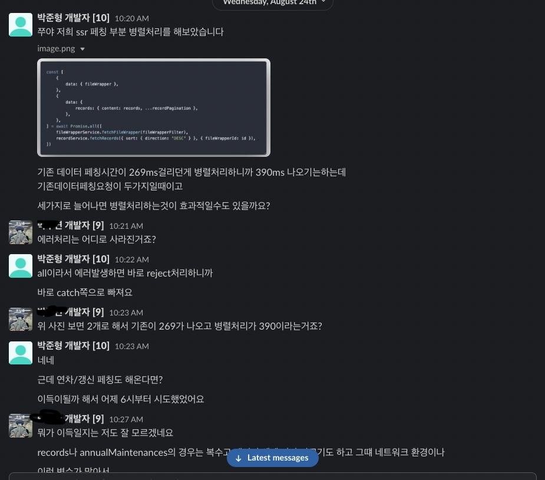

## 글을 쓰게 된 이유

개발중인 **파이인트라넷**(백오피스)의 개발중

한페이지(사건포대 상세페이지)에 진입시 기존에는 서버사이드 페칭으로 요청해야할 데이터가 최대 3개에서, 최소 3개 최대 5개로 늘어나게되었다.

이 모든것을 직렬로 데이터 요청을 하다보니 3개일때에는 0.3초가 걸리던 요청이 5개일때는 간헐적으로 0.8초씩 걸리는 현상을 발견하게 되었다.

그러던 중 지난 토스 개발자 컨퍼런스에 보았던

[`잃어버린 유저의 시간을 찾아서`](https://youtu.be/IKyA8BKxpXc)세션에서 보았던 글이 생각났었다.


유저가 10명일때 페이지 진입시 0.8초 걸리는 작업이라면 총 8초가 걸리고, 0.3초 걸리는 작업이라면 총 3초가 걸리게된다.
하지만 유저가 100명, 1,000명, 10,000명... 나아가 1,000,000명의 존재한다고 했을때,,


우리 서비스는 2.6배나 유저의 시간을 빼앗게된것(도둑)이 되어버린다. 이상적인것은 `서버요청응답시간`이 짧아지는것이지만, 그동안 프론트엔드에서 해줄 수 있는 작업을 최대한 해주는것이 **유저 친화적인 개발자**가 되는것이라고 정의하였고, 이를 어떻게 해결했는가에 대해서 간단히 예시와 함께 경험 공유하려한다.

## 기존코드

```js

export default class 사건포대상세페이지 {
  constructor(){
    ... 생성자 함수 로직
  }
  static async getInitialProps({ pathname, query, apolloClient, ...ctx }) {
    const { id } = query
    try{
      ...서비스 인스턴스 생성 로직

      const { errors: errors1, loading : loading1, data: data1 } = 서비스인스턴스1.fetch데이터1(id)
      if(errors1) throw errors1

      const { errors: errors2, loading : loading2, data: data2 } = 서비스인스턴스2.fetch데이터2(id)
      if(errors2) throw errors2

      const { errors: errors3, loading : loading3, data: data3 } = 서비스인스턴스3.fetch데이터3(id)
      if(errors3) throw errors3

      return { pathname, query, apolloClient, data1, data2, data3 }

    }catch(error){
      return { pathname, query }
    }
  }
}

```

위와 같이 3개의 요청을 보내던 1차기획과 달리 2차기획 + 3차기획이 달라붙어 **사건포대상세페이지**에서는 특정 조건일때에 5개의 요청을 보내야하는 상황이 발생하게되었다..

기존의 방법과 같이 고대로 2개의 요청을 적어서 기한안에 맞춰 개발했지만.. 마음속 어딘가 분명 이건 아닌데,, 싶은 맘이 생겼었다.

```js

export default class 사건포대상세페이지 {
  constructor(){
    ... 생성자 함수 로직
  }
  static async getInitialProps({ pathname, query, apolloClient, ...ctx }) {
    const { id } = query
    try{
      ...서비스 인스턴스 생성 로직

      const { errors: errors1, loading : loading1, data: data1 } = 서비스인스턴스1.fetch데이터1(id)
      if(errors1) throw errors1

      const { errors: errors2, loading : loading2, data: data2 } = 서비스인스턴스2.fetch데이터2(id)
      if(errors2) throw errors2

      const { errors: errors3, loading : loading3, data: data3 } = 서비스인스턴스3.fetch데이터3(id)
      if(errors3) throw errors3

      const { errors: errors4, loading : loading4, data: data4 } = 서비스인스턴스4.fetch데이터4(id)
      if(errors4) throw errors4

      const { errors: errors5, loading : loading5, data: data5 } = 서비스인스턴스5.fetch데이터5(id)
      if(errors5) throw errors5

      return { pathname, query, apolloClient, data1, data2, data3, data4, data5 }

    }catch(error){
      return { pathname, query }
    }
  }
}

```



그래서 쭈야에게 **병렬처리**를 해보겠다는 제안을했었다. 하지만 내 생각과는 달리 병렬처리한다고 `무조건` 시간이 빠른것도 아니며, 사용자의 네트워크 환경에 따라 결과가 달라질수도있다는 대답을 받았었고, 에러핸들링에 대한 부분이 매우 부족했기때문에 조금더 다듬어서 제안해야겠다고 생각했었고, 그렇게 1주일이 지났다.

그동안 테오의 프론트엔드톡방 및 노마드코더에서 비동기 처리에 대한 질문을 많이헀었다.

도움받았던 분들이 많은데 그분들의 도움덕에 더욱더 다음은 코드로 다시한번 쭈야께 피드백및 리뷰 요청을 드렸었고, Approved되어서 얼렁 사건포대상세페이지와 비슷한 페이지인 업무상세페이지도 병렬처리로 변경하였다!


```js
export default class 사건포대상세페이지{
  static async getInitialProps({ pathname, query, apolloClient, ...ctx }) {
    const { id } = query

    try {
      const fileWrapperFilter = { id }
      ...서비스 인스턴스 생성 로직

      ...fetch 함수 정의 로직

      const {
        데이터1, 에러1,
        데이터2, 에러2,
        데이터3, 에러3,
        데이터4, 에러4,
      } = await Promise.all([
        fetch데이터1, fetch데이터2,
        fetch데이터3, fetch데이터4,
      ]).then(
        ([
          { errors: 에러1, loading: 로딩1, data: { 데이터1 } },
          { errors: 에러2, loading: 로딩2, data: { 데이터2 } },
          { errors: 에러3, loading: 로딩3, data: { 데이터3 } },
          { errors: 에러4, loading: 로딩4, data: { 데이터4 } },
        ]) => ({
          데이터1, 에러1,
          데이터2, 에러2,
          데이터3, 에러3,
          데이터4, 에러4,
        }),
      )
      if (에러1) throw 에러1
      if (에러2) throw 에러2
      if (에러3) throw 에러3
      if (에러4) throw 에러4

      return { pathname, query, 데이터1, 데이터2, 데이터3, 데이터4 }
    } catch (errors) {
      return { pathname, query }
    }
  }
}
```

위와 같이 코드를 짜보았는데, Promise.then 에서 return 해주는 데이터들을 다시한번 리턴시켜주며
만약 저 요청들중 N번 요청이 reject 된다면 에러N이 catch문으로 보내기때문에 에러핸들링도 더욱더 명확해 보였다.

쭈야에게도 다시 작성한 코드를 보여드리니 칭찬해주셨다.


## 느낀점

사실상 내가 해준 작업은 **직렬**로 요청되던 데이터 요청 처리를 `Promise.all` 로 모두 **병렬**요청로 바꾼것밖에는 없지만
`사용자측면`에서 생각해서 사내코드를 리팩토링해보았고 결과론적으로 페이지 진입시간을 0.8초에서 0.3로 줄여주었다는 점이 아주 인상깊었다.
