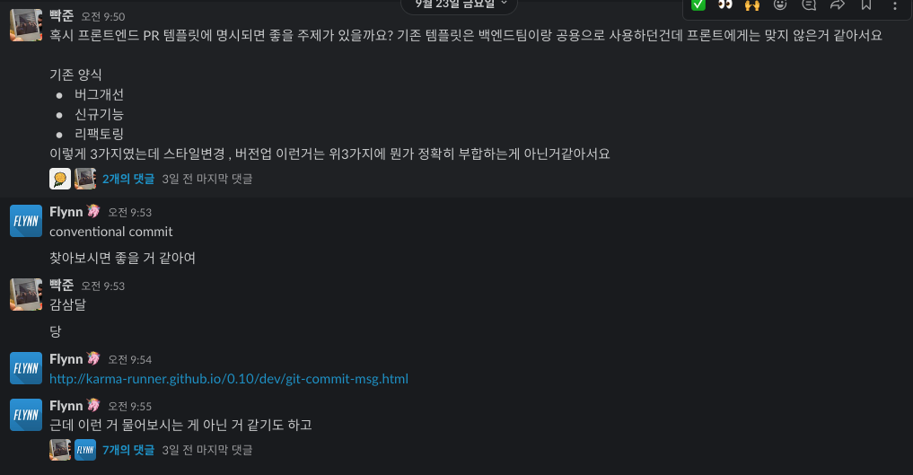
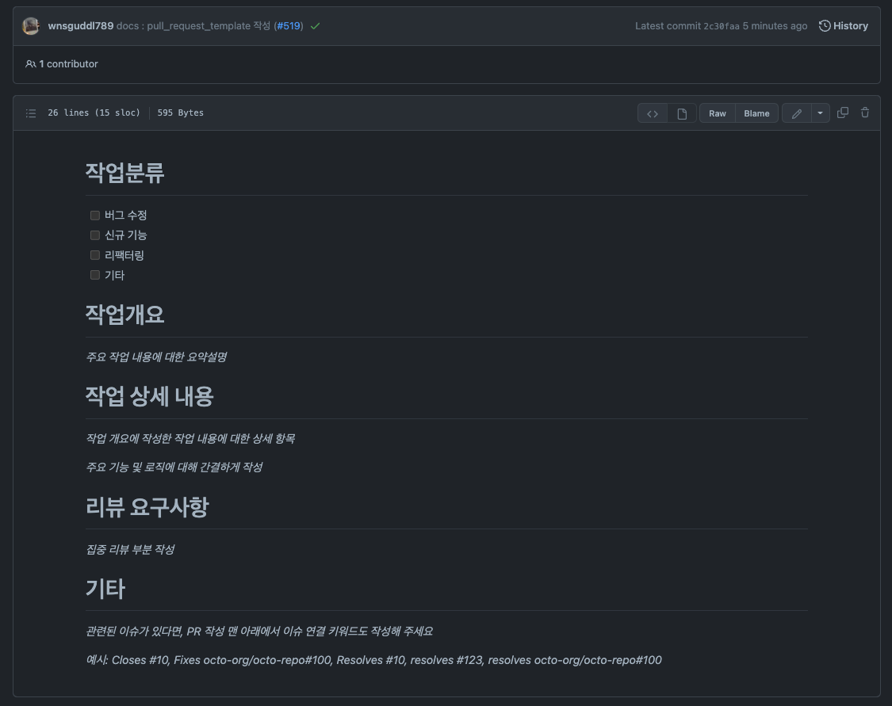

## Pull Request가 왜 중요할까

현재 세진마인드의 프론트엔드 개발자는 나를 포함하여 두명이다.

혼자 개발할때에는 나만 개발하기에 A기능에 어떻게 개발했는지 자세히 적을 필요가 없을수도 있다.(물론 미래의 나에게 두들겨 맞겠지만,,)

하지만 나를 제외한 다른 개발자가 내가 작성한 코드를 보았을때 아래와 같이 나눌 수 있다고 생각한다.

-   왜 그런 로직을 작성했는지?
-   기존코드에서 무엇이 수정되었는지?
-   어떤 생각으로 컴포넌트를 분리하였는지?

### 현재 PR 템플릿의 문제점이 무엇인가

현재 프론트팀이 사용하고 있는 템플릿이다..! 

-   버그수정
-   신규기능
-   리팩터링

버그수정과 신규기능 옵션은 남겨놔도 괜찮은 항목인것같다. 
이유는 지금것 매우 잘써왔고 `fix` 브랜치 혹은 `feat` 브랜치에서 매우 잘사용해왔다  

리팩터링도 사용은 해왔었지만.. 항상 체크할때마다

> 내가 작성한 코드가 **리팩터링**인가? 
> 단순히 **스타일 변경코드**인데도 **리팩터링**으로 의미전달이 되는것이 아닌가?

### 더 좋은 템플릿은 어떤기능이 추가되면 좋을까?

위와 같은 질문으로 머릿속을 헤맬때에 다른분들께  FE에게 좋은 PR템플릿에는 무엇이 필요할까요 라는 질문을 했었다.

노마드코더 커뮤니티의 두분께서 좋은 답변을해주셔서 너무 감사했다 (Flynn님, Jonghwan Won님 감사합니다 🙇)

FE , BE 공통 PR 템플릿(설명, 테스트, Jira Ticket)을 운용하며, FE는 추가로 preview 이미지와 크로스브라우징 관련 내용을 포함한다고 설명하셨었다..! 
종환님의 아주좋은 추천이었다!! 나는 여기서 공통템플릿과 preview를 Front Pull Request 템플릿으로 운용해보려고 한다.

이유는 기존의 템플릿을 운용하고있는 백엔드 템플릿과는 너무 다르지않게 점진적으로 추가하려하며, 그리고 PR내용이 너무 길어진다면,
Reviewee(보통 본인) 와 Reviewer(보통 사수님)에게도 피로함을 느끼게될것이기 때문이다.

[커밋룰](http://karma-runner.github.io/0.10/dev/git-commit-msg.html)처럼 템플릿도 분기처리하면 좋을것같다는 추천을 받았다.

내가 가장먼저 고민했던 부분인것같다.  서두에 **리팩터링이 아닌 단순 스타일변경코드인데? 리팩터링으로 의미전달이 잘못되고있는게 아닌가?** 라는 질문에 답변이 되는 느낌이었다.

그리고 플린님께서 말씀하신 저런 내용들이 커밋에 녹아져 버전업데이트를 자동화하자! 이 말이 상당히 신선했다.

커밋룰 리스트를 확인해보면

-   feat : 기능개발
-   fix : 버그개선
-   refactor : 리팩터링

여기까지는 기존의 PR template와 일치하지만 추가하고싶은 부분이 더있는데

> style : (formatting, missing semi colons,, etc : no code change)

이부분이었다. FE의 특성상 코드 style변경과 실제 ui 컴포넌트 스타일변경이 있을수있다. 
가령.. 드롭다운 메뉴 대신 버튼으로 변경하자 라는 기획이 들어오면 로직은 변경하지 않지만 view UI가 변경되어야하는데
이건 code formatting과는 거리가 먼것 같아서

`format` 과 `style`로 나누면 괜찮을것같다.

-   format : 코드 포매팅 변경, 코드의 형태는 변경하지않음
-   style : ui 컴포넌트의 스타일변경

이라는 제약사항을 걸어놓는다면? 해당 PR이 어떠한 역할을 하는지 더욱더 명확해지지 않을까라는 생각을 하게되었다.

### 결론적으로 PR에 들어가야할 사항

-   어떠한 상태의 PR? (fix | feat | refactor | style | format)
-   어떤 작업을 완료했는가? (summary)
-   리뷰하는데 얼마나 걸릴지? 걸린다면 얼마나 걸릴지 예상시간 (time)
-   Review 요청 이전에 한일 (예를들어 모킹데이터로 api테스트를 완료했다)
-   PR Approved 된 후의 해야할일 (다음 스크럼에 해야할일을 간략하게)
-   첨부사진 (optional)(preview image)

위와같이 결론이 지어졌다. 이로써 한번 아래와 같이 템플릿을 만들어보았다. 

이제 우리 사수님께 건의를 드려보도록 해야겠다!

사수님께 컨펌을 받고왔다!

스타일과 포매팅이 쓰이는 PR이 그리 많지않을것같아

스타일은 버그 수정에 녹여내기로  
포매팅은 리팩터링 중간에 보통 포함될테니 배제하는것으로 생각하고

pr 설명 부분의 멘트들을 더 다듬고 리뷰시간과 기타 메세지 부분을 `리뷰 요구사항` 하나로 통합하였다.

사수님께서 백엔드에서도 통합할 수 있다면 통합하게 건의해보자고 하셔서 건의를 했었고 28일 수요일 팀회의로 소거할 부분은 소거하게되었다.

소거 된 부분은 리뷰시간과 같이 추상적인 부분은 제거되었다.

그리고 Preview 이미지 업로드는 사실 프론트에서 더 필요할 것 같고, 백엔드는 테스트 결과정도 일테니

기타로 통합하여 관리하기로 하게되었다.

목적은 프론트에게 잘맞는 Pull Request Template 작성이었지만, 팀 내부적으로 효과적인 PR 템플릿을 만들게된 경험이었다.
(이것도 팀 생산성을 위한 기여라고 생각해도 될까?)

팀회의 이후에 템플릿을 백엔드 팀원에게도 전달하였고 둘다 develop 브랜치에 반영하여 사용하게 되도록 하였다!

(짜잔... 보람찼다)

팀의 생산성을 위하여 고민하고 개선시켜본 경험은 개발자로써 처음이었다.  
작은 팀이고 스타트업이기 때문에 생산성이 중요한만큼 내가 기여할 수 있던 경험이었다.
