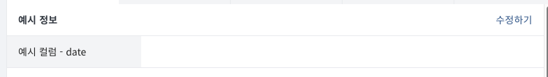
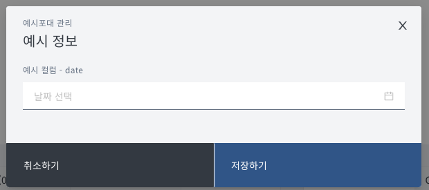
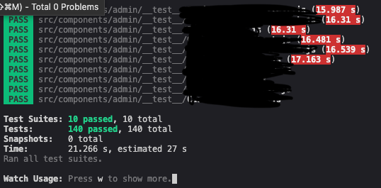

## ??? : 테스트코드 도입으로 꿀좀 빨고싶습니다.

불행한 만고불변의 진리중 하나인 **요구사항은 언제나 변경될 수 있다**는것이다.<br/>
그렇게 그 안타까운 현실이 나에게도 다가왔다.

<hr />

### Description

간략하게 설명을하고 경험공유를 시작하겠다.

**PIIP 인트라넷** 개발중 포대 상세페이지 개발을 들어갈 당시 **상세페이지**의 레이아웃을 변경하는<br/> 포대의 상태는 총 4가지였다.

4가지 타입의 상태를 가지고 필터와 데이터컬럼 타입을 만들어주었고,<br/>
포대의 상태와 필터링 필드에 의해서 dataColumn이 해당 상태에서 걸러지는지 안걸러지는지에 대한 **유틸함수**는 이미 만들어놨었다.

```ts
type AType = 'A-a' | 'A-b' | 'A-c'
type BType = 'B-a' | 'B-b' | 'B-c'
type CType = 'C-a' | 'C-b' | 'C-c' | 'C-d'
type DType = 'D-a' | 'D-b' | 'D-c' | 'D-d'

type FilterField = {
	AType: AType
	BTypes: BType[]
	CTypes: CType[]
	DTypes: DType[]
}

type ContentField = {
	isFullWidth: boolean
}

type FormField = {
	type: 'date' | 'text' | 'number'
	required: boolean
	isModalFullWidth: boolean
}

type DataColumn = {
	index: number
	name: string
	label: string
	filterField: FilterField
	contentField: ContentField
	formField: FormField
}
```

예시정보 섹션에 아래와 같은 데이터컬럼들이 존재할수도있다고 가정해보자

내가 바라는것은 포대의 상태중 `BTypes`이 `B-b`일때에는 아래 사진과 같이 출력되어야 한다.<br/>
미리 작성해둔 필터함수(유틸함수)에 의해 BTypes가 `B-a`라면 걸러지는것이다.

```ts
const dataColumns: DataColumn[] = [
	{
		index: 0,
		name: '예시정보 - date graphQL 컬럼',
		label: '예시정보 - date',
		filterField: {
			AType: 'A-a',
			BTypes: ['B-a'],
			CTypes: ['C-a', 'C-b', 'C-c', 'C-d'],
			DTypes: ['D-a', 'D-b', 'D-c', 'D-d'],
		},
		contentField: {
			isFullWidth: true,
		},
		FormField: {
			type: 'date',
			required: false,
			isModalFullWidth: true,
		},
	},
	{
		index: 1,
		name: '예시정보 - text graphQL 컬럼',
		label: '예시정보 - text',
		filterField: {
			AType: 'A-a',
			BTypes: ['B-b'],
			CTypes: ['C-a', 'C-b', 'C-c', 'C-d'],
			DTypes: ['D-a', 'D-b', 'D-c', 'D-d'],
		},
		contentField: {
			isFullWidth: true,
		},
		FormField: {
			type: 'text',
			required: false,
			isModalFullWidth: true,
		},
	},
]
```

**수정하기** 버튼을 클릭시 모달에도 필터링된 폼필드들이 출력되는 조건으로 컴포넌트 설계를 했었다.

위에서 나의 의도대로 잘 필터링되었다.





### 그럼 무엇이 문제인가?

예상대로 잘 동작하고 기능에 이상은 없지만, 유지보수에서 곤욕을 치뤘다.

위에서 제시한 예시는 겨우 예시정보의 2개의 컬럼만을 예시로 들었다.

하지만 예시정보와 같은 섹션은 당연하게도 하나가 아니다. 적게는 2개 많게는 6개까지 존재한다.

우리팀은 요구사항이 변경되면 외부 엑셀시트에 섹션에 들어가야하는 컬럼들에 대해 작성해두었다. 이를 참조하여 변경에 대응하여 프론트도 백도 변경해주었다. <br/>
백엔드는 모르겠지만 (??) 프론트가 조금 힘들었었다.

포대에 속한 컬럼이 대략 120개정도 되고 상태에 의해 변경되어야하는 컬럼의 조합이 스무가지나 되니 기준이 모호해지고 관리하기가 매우 어려워지기 시작했다.

그래서 변경되는 요구사항에 올바르게 대응해야겠다는 판단이 들었고<br/>
사수분과 매니저님께 건의를 드렸다.

**눈으로 검증하는것에는 한계가 존재하는것같습니다.<br/>
스무가지의 컬럼의 가지수를 정리하고 정리된 컬럼들의 배열의 순서까지 검증하는 단위테스트를 도입하고싶습니다.**

그렇게 OK를 받았다.

### 자 건의는 성공했고, 수습을 해보자.

**어떻게 스무가지의 컬럼을 검증해낼까?** 를 생각해보았다.

-   개발문서들을 최신화한다.
-   최신화된 문서들로 하나의 시트를 생성하고 시트를 기준으로 잡는다.
-   기준이 된 시트를 json데이터로 만들어준다.
    -   json 데이터는 출력될 컬럼의 라벨, 컬럼명 그리고 순서까지 고려한다.
-   json데이터를 TC로 필터링된 dataColumns가 통과하는지 확인한다.

```ts
describe('예시정보 국문명, 컬럼명, 순서가 일치하는가?', () => {
  it('A상태 B상태', () => {
    const filter = { 포대의 상태를 설명 }

    const convertExpectColumnFn = (columns) => columns.map(({ label, name }) => ({ label, name }))
    const convertFilteredColumn = (columns,filter) => columns.map((col) => filteringColumns(column, filter))
    // filteringColumns -> 미리 작성해두었단 필터링 유틸함수

    const filteredColumns = convertFilteredColumn(columns, filter); // 필터링된 dataColumns
    const expectColumns = convertExpectColumnFn(currentComponentColumns); // TC

    expect(filteredColumns).toStrictEqual(expectColumns)
  })
})

```

`filteredColumns`가 `expectColumns`와 순서까지 일치하면 되는 코드로 작성했다.

테스트케이스가 **총 140개**가 되어 모든 케이스를 **통과**시켰고,<br/>
팀생산성에 기여하고 제목대로 앞으로 꿀을좀 빨수있겠다는 생각이 들었다.



<hr />

가장 힘들었던것은 테스트케이스 작성을 위한 문서의 최신화와 최신화된 문서를 기반으로 json데이터 작성하는 작업이 가장 시간이 많이 소요되었다. 약 2~3일이 소요되었는데 최신화를 위해 매니저님을 내가 많이 못살게 굴긴했다 ㅋㅋ

이거 맞나요? 이컬럼이 유효한가요? 피그마와는 다른데?... 라고 말이다 ㅋㅋ<br/>
이 자리를 빌어 **매니저(호이)** 에게 감사하다는 말을 전하고싶다

**사수(쭈야)** 감사했던점은 테스트코드 도입을 위해 동의해주셨던점과 **매니저(호이)** 에게 의견을 실어주셨던점과 테스트를 위한 문서를 함께 작성해주셔서 감사했다.

처음해보았던 환경설정도 힘들었는데 테스트환경과 프로덕션환경에 차이를 두는것이 어려웠다.

jest은 ESM을 실험적으로 지원하기에 babel설정이 거의 필수적이었는데 처음으로 업무에서 **ChatGPT**를 활용해보았다. <br/>
**ChatGPT** 이놈 쓸만하다는것을 느꼇다.

Lerna 모노레포 환경에서 jest를 어떻게 붙여야하며 RTL도 붙이는 법을 다 알려주는데 정말 편하고 좋은 경험이 되었다.
