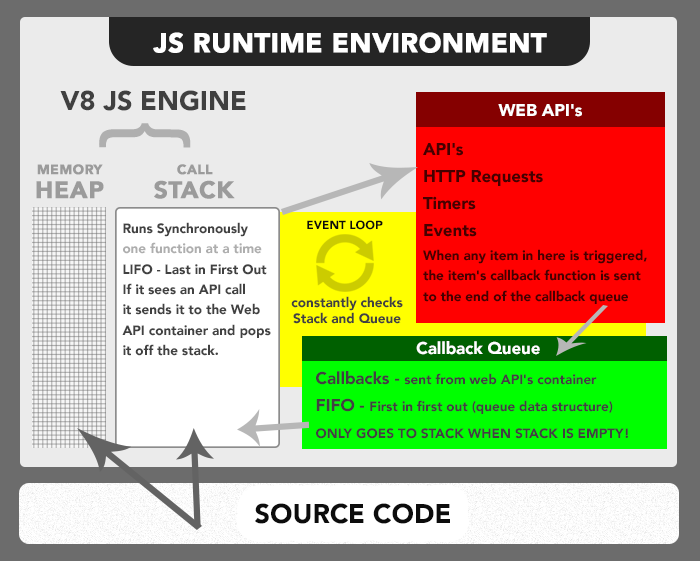

하나의 프로세스는 아래 4가지로 이루어진다.

- code
- stack
- heap
- data

프로세스 안에는 여러가지 쓰레드가 존재할 수 있다. 만약 멀티쓰레딩의 프로그램이 있다면, 각각의 쓰레드들은 **code**, **heap**, **data**을 공유하고 각 쓰레드 자신만의 **stack**을 가진다.

### 엥? JS는 싱글스레드 언어인데?

싱글 스레드라는건 함수가 호출되어서 쌓이는 스택이 하나뿐이라는 소리다. (한번에 하나의 일밖에 수행하지 못한다는것)

`setInterval`, `promise`, `setTimeout` 등 **멀티쓰레딩**처럼 동작하는것처럼 보이는 이유는 자바스크립트의 런타임 환경에 있다.

### 자바스크립트의 런타임 환경



1. Heap(JS Engine)
   - 메모리가 할당되어 있는곳, Heap의 메모리는 파편화되어 저장되어있다.
2. Call Stack(JS Engine)
   - 코드가 쌓여서 실제로 수행되는곳
3. Web APIs
   - setTimeout 등이 call Stack에서 실행되면 스택에서 사라짐과 동시에 Web APIs에서 동작한다. 해당 api의 실행이 끝날때 callback을 task queue로 넘긴다.
4. Call Back Queue
   - Web API의 실행이 끝나고 등록되어 있던 call back이 쌓이는곳
   - micro queue와 task queue
5. Event Loop
   - Call back queue에 쌓여있는 js의 callback 메서드들을 JS의 콜스택으로 넘긴다.

**JS가 멀티쓰레드처럼 동작하는 이유는 Web API를 호출하면 JS는 콜스택에서 실행함과 동시에 해당 일을 web 브라우저에게 위임하고 할일을 수행하기 때문이다.**

### 이벤트 루프

이벤트루프는 아래 4부분을 돌며 감시한다.(`Non-Blocking` 상태로 아래를 감시)

1. JS CALL STACK
   - `JS Call Stack`에 **Call back 메서드**가 존재하면, 이벤트 루프는 콜백이 비워질때까지 `Block`된 상태로 있는다.
2. RENDER
   - 화면을 새롭게 렌더링한다. 브라우저는 **60 FPS**를 유지하려는 특성이있는데, 유지하기 위해서는 **16.7ms**의 속도로 한번씩 렌더링 해줘야한다.
   - 이벤트 루프가 `Non-Blocking` 상태로 감시영역을 도는 속도는 보통 **1ms** 정도 되는데, Render에 무언가 할 일이 있더라도 이벤트 루프는 Render를 바로 하지않고 타이밍을 재가면서 Render를 한다는것이다.
   - 만약 사용자가 `requestAnimationFrame` 메서드를 사용하려 한다면, 이 메서드들은 Render의 가장 앞부분에 있는 큐에 들어가게 되고 이벤트 루프가 Render로 왔을때 가장먼저 차례로 수행된다.
3. TASK QUEUE
   - 해당 `큐`에 수 많은 콜백이 쌓여있다고 해도 **단 하나의 콜백**만 `JS의 콜스택`으로 옮긴다. 그리고 **`이벤트루프`** 자신도 함께 `JS 콜스택`으로 넘어간다. **setTimeout** 등에 들어온 콜백들이 여기로 온다.
4. MICRO QUEUE
   - 만약 해당 `큐`에 수많은 콜백이 있다면 `이벤트 루프`는 모든 콜백을 처리할때까지 움직이지 않는다.(**`Block`** 상태에 빠진다)

## setTimeout이 실행되면 어떤 동작이 일어나는가?

1. 코드블록에서 해당 코드가 실행되며 call Stack에 올라간다.
2. setTimeout을 JS의 콜스택에서 실행한다
3. web API이므로 web API으로 옮긴다
4. JS 콜스택에서 setTimeout에 관련된 Active Record가 제거된다.
5. 브라우저는 setTimeout을 실행한다.
6. JS call Stack과 Task & Micro Queue에는 아무것도 없으므로 이벤트 루프는 일이 일어나기만 기다리며 돈다(논블라킹)
7. 브라우저에서 setTimeout이 실행을 끝냈다면, 해당 메서드에 전달되었던 Call back 이 Queue로 이동한다.
8. 이벤트루프는 런타임환경을 살펴보다 Queue에 **Call back 메서드**가 들어온걸 Queue에서 멈춘다.
9. JS Call Stack을 확인한다. 만약 Call Stack에서 무언가 수행중이라면 이벤트 루프는 Queue에 대기한채 기다린다.
10. JS Call Stack이 비었다면, 이벤트 루프는 Queue에 있는 **Call back 메서드**를 JS의 콜스택으로 이동시킨다.
11. 이동된 **Call back 메서드**는 실행이된다.

## Block은 실행이 보장된다.

위에서 `Call Stack` 에서 무엇인가 실행되고있다면, 실행되고있는 것의 Block은 보장된다는것을 알 수 있었다.

```jsx
const $button = document.querySelector("button")
const $element = document.createElement("span")

/**
 * @version_1
 * Element를 append 해준 후 속성처리를한다.
 */
$button.addEventListener("click", () => {
  document.body.appendChild($element)
  $element.style.color = "red"
  $element.innerText = "블락이 보장될까요?"
})

/**
 * @version_2
 * 속성처리를 해준 후 Element를 append를한다.
 */
$button.addEventListener("click", () => {
  $element.style.color = "red"
  $element.innerText = "블락이 보장될까요?"
  document.body.appendChild($element)
})
```

### **[1번 상황]의 상황에서 생각해볼 수 있는 문제점**

- 생성된 DOM을 body에 append한다.
- append가 되는 순간 브라우저에 **Render**한다.
- 렌더링 된후에 인라인 style들이 지정되지 않아 원치 않는 결과가 나온다.

**문제는 일어나지 않게된다.**

> 콜 스택에서는 실행되고 있는 Block이 보장된다.

버튼을 누르게 되면 **콜백**으로 등록한 함수(arrow function)가 `JS Call Stack`으로 들어가게되고, 이 **콜백**은 반드시 보장된다.(콜백이 종료될때까지 이벤트 루프는 Block을 보장한다)

### 그럼 Block이 보장된다는 점을 이용해서 브라우저를 죽여보자…

```html
<html>
  <head>
    ...
  </head>
  <body>
    <button />
  </body>
  <script>
    const $button = document.querySelector('button');
    $button.addEvnetListener('click', () => {
    	while(true)
    })
  </script>
</html>
```

> 예상되는 동작은 무엇일까?

1. **addEventListener**가 `web API`를 통해 실행된다.
2. 유저가 버튼을 **클릭**시 브라우저는 이를 감지하고 **Call Back Method**(arrow function)을 `Task Queue`로 넘긴다.
3. `이벤트 루프`는 `Task Queue`에 멈춰서 `JS Call Stack`을 감시한다.
4. `JS Call Stack`이 비었다는것을 알게 되는 순간 **Call back Method**를 `JS Call Stack`으로 옮긴다.
5. `이벤트 루프`도 마찬가지로 `JS Call Stack`을 감시하게 된다.
6. 이제 `이벤트 루프`는 `Call Stack`에 있는 블록이 끝날때까지 **블록**되어있는다.

`이벤트 루프`가 계속 Block 상태라는것은 브라우저의 렌더링도 되지않으며, 다른 큐에 있는 메서드들을 실행할수 없게 되는것이다.

위의 예에서는 JS Call Stack에서 while문이 loop를 종료하지 않게되며, `이벤트루프`도 Block 상태라서 브라우저는 아무것도 하지 못하고 죽게되는것이다.
