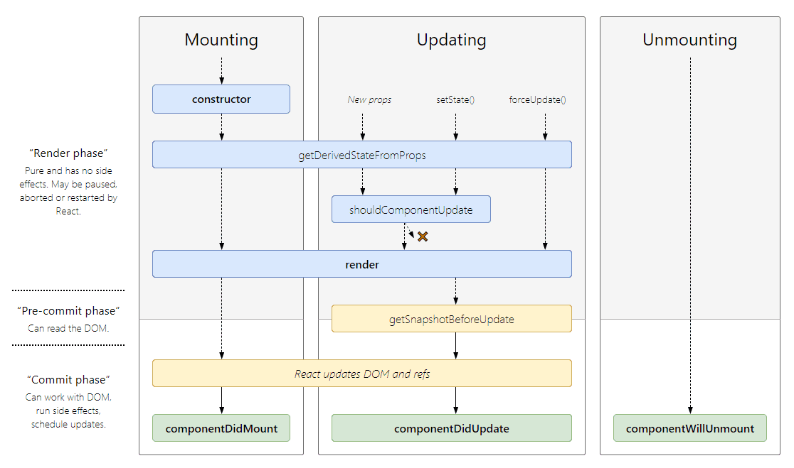

# Phase에 다뤄본다.

위 그림은 클래스 컴포넌트의 라이프사이클 실행 시점을 자세히 알려준다.

그런데 왼쪽에 `Render Phase`, `Pre-commit Phase`, `Commit Phase`라는 설명들이 붙어있다.

-   Render Phase : 순수하며 사이드 이펙트가 없습니다. React에 의해 중지되거나 재실행될수도있다.
-   Pre-commit Phase : DOM을 읽을수있다.
-   Commit Phase : DOM과 함께 일할수 있으며 사이드 이펙트가 일어나며, 업데이트를 스케쥴한다.

이렇게만 읽어보면 어떤 느낌인지 자세히 알수가 없다.

## Render Phase

Render Phase에는 쉽게 말해 VDOM 조작 단계라고 생가하면된다. React는 변경점이 생겼을때에(element 추가 수정 삭제) 이를 VDOM에 반영하기 위해 **Work**를 담당하는 함수를 scheduler를 통해 실행시킵니다

> Work는 reconciler가 컴포넌트의 변경을 DOM에 적용하기 위해 행하느 작업을 Work로 통칭한다고 생각하면된다. Work를 통해 Render Phase, Commit Phase가 진행된다.

Render Phase에는 VDOm을 재조정하는 과정이다. 재조정을 담당하는 reconciler의 설계가 스택 기반에서 fiber architecture로 넘어오며 이 과정을 abort, stop, restart 할 수 있게 되었다.

#### 참고링크

-   https://goidle.github.io/react/in-depth-react-intro/
-   https://yceffort.kr/2022/04/deep-dive-in-react-rendering
