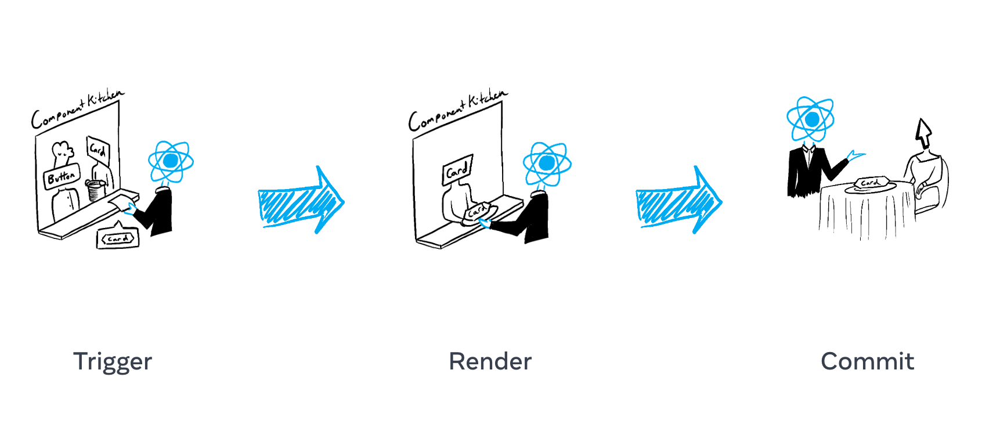
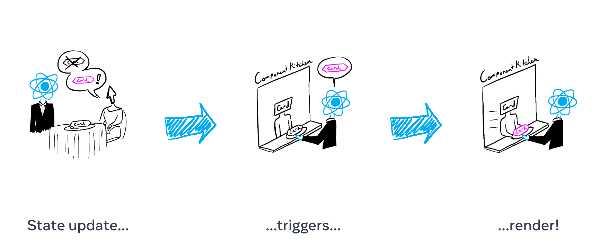
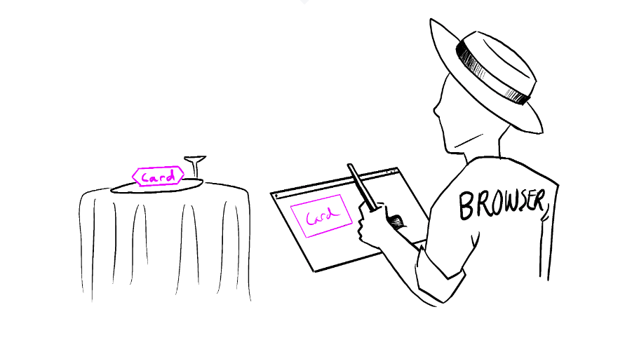

해당 글은 [리액트 베타문서 Render and Commit](https://beta.reactjs.org/learn/render-and-commit) 번역입니다


당신의 컴포넌트가 화면에 표현되기 전에, 그들은 반드시 React에 의해 렌더링된다.이 프로세스의 단계를 이해하면 내 코드가 어떻게 실행되는지와 동작을 설명하는데 많은 도움이 될것이다.

# 배울수있는것

-   React에서 렌더링이란 무엇인가?
-   언제 그리고 왜 React 컴포넌트가 렌더링되는가?
-   컴포넌트를 화면에 표시하는 단계
-   렌더링이 항상 DOM 업데이트를 생성하지 않는 이유

컴포넌트가 주방에서 맛있는 요리가 재료에서 요리중이라고 상상해보자. <br/>
이 시나리오에서 **React**는 손님의 요청을받고 그의 주문을 가져오는 **웨이터**라고 생각하면된다

이 UI 서빙 요청은 아래 세 단계를 따른다.

-   **Triggering a render** (손님의 주문을 주방으로 전달한다)
-   **Rendering the component** (주방에서 주문을 준비한다)
-   **Committing to the DOM** (손님 테이블에 요리를 내놓는다)



## Trigger a render

컴포넌트가 렌더 되는 조건은 두가지가있다

-   컴포넌트의 초기 렌더링
-   컴포넌트의(혹은 조상 중 하나의 컴포넌트) 상태가 변경된 경우

### Initial Render (초기렌더링)

애플리케이션이 시작할때, 초기렌더링을 위해 트리거를 발생시킬 필요가있다. 프레임워크는 종종 이 코드를 가리지만, 하지만 이 코드는 `createRoot`에 의해 target DOM Node를 호출하고 `render` 메서드와 함께 우리의 컴포넌트를 호출한다.

```jsx
// src/index.js
import App from "./App";
import { createRoot } from "react-dom/client";

createRoot(document.getElementById("root")).render(<App />);

// index.html
<html>
  <head>..</head>
  <body>
    <div id="root" />
    <script src="./src/index.js">
  </body>
</html>;
```

### Re-renders when state updates (상태가 변경된 경우)

초기 렌더링이 완료된 컴포넌트는 setter 함수로 상태를 업데이트하여 리렌더링을 트리거할수있다. 컴포넌트의 상태를 업데이트하면 자동으로 렌더큐에 대기하게 된다. (레스토랑의 손님이 차, 디저트등을 첫 주문이후 주문하는것으로 상상하면된다.)



## Rendering the component

렌더링 트리거가 발생한 이후, React는 스크린에 표시할 내용을 결정하기 위해 컴포넌트를 호출한다.

**Rendering**은 React가 당신의 컴포넌트를 호출하는것을 뜻한다.

-   초기 렌더링에, React는 root 컴포넌트를 호출한다.
-   다음 렌더링에, React는 상태변경이 렌더를 트리거한 함수 컴포넌트를 호출한다.

이 프로세스는 재귀적이다. 만약 업데이트된 컴포넌트가 다른 컴포넌트를 반환한다면, React는 해당 컴포넌트를 다음에 렌더링하고, 해당 컴포넌트가 무언가를 반환하면 다음에 해당 컴포넌트를 렌더링한다. 이렇게 중첩된 컴포넌트가 없을때까지 프로세스는 계속되고 React는 화면에 표시되어야 할 내용을 정확히 알 수 있다.

아래 예제를 보면 React는 Gallery()와 Image()를 여러번 호출한다.

```jsx
export default function Gallery() {
	return (
		<section>
			<h1>Inspiring Sculptures</h1>
			<Image />
			<Image />
			<Image />
		</section>
	)
}

function Image() {
	return 
}
```

-   **첫 렌더링동안** React는 `<section>`, `<h1>`과 3개의 ``태그의 Dom nodes를 생성한다.
-   **리 렌더링동안** React는 이전 렌더 이후 변경된 속성이 있는 경우, 다음 단계인 Commit Phase까지 해당정보에 대해 아무런 조치도 취하지 않는다.

> 렌더링은 반드시 [Pure Calculate](https://beta.reactjs.org/learn/keeping-components-pure)를 따른다

-   **same inputs, same outputs** 같은 inputs이 주어질경우 컴포넌트는 항상 같은 jsx를 반환한다.
-   **이것은 책임이다.** 렌더링하기 전에 존재했던 객체나 변수를 변경해서는 안된다.

위를 따르지 않으면, 코드베이스가 복잡해짐에 따라 혼란스러운 버그와 예측할 수 없는 동작을 야기할수있다. Strict Mode로 개발할때 React는 각 컴포넌트를 두번 호출하여 불순한 함수로 인한 실수를 방지할수있게 해준다.

> 성능최적화

업데이트된 컴포넌트가 트리에서 매우 높은 경우 업데이트 된 컴포넌트 내부에 중첩된 모든 컴포넌트를 렌더링하는 기본동작이 성능 최적하는 아니다. 성능 문제가 발생할 경우 성능 최적화 섹션에 설명된 몇가지 옵션을 사용하여 해결이 가능하다.

**너무 빨리 최적화하려하지말라!**

## Committing to the DOM

컴포넌트를 렌더링(호출)한 후에 React는 Dom을 수정한다.

-   **첫 렌더링의 경우** , React는 `appendChild()`DOM API를 사용해 생성한 모든 Dom node를 화면에 배치한다.
-   **리 렌더링의 경우** , React는 최신 렌더링 출력결과와 일치시키기 위해 필요한 최소한의 연산(렌더링중에 계산완료)을 적용한다.

React는 렌더링간에 차이가 있는 경우에만 DOM node를 변경한다. 예를 들어 매초마다 부모 컴포넌트로부터 props를 전달받아 리렌더해야하는 컴포넌트가 있다고 하자. input 태그에 어떤 텍스트를 쓰더라도 props로 받아온 시간은 변경되어도 input태그의 입력한 텍스트는 리렌더되며 사라지지 않는다.

<div>
	<iframe
		src="https://codesandbox.io/embed/exciting-solomon-tq2f7n?fontsize=14&hidenavigation=1&theme=dark"
		style="width:100%; height:500px; border:0; border-radius: 4px; overflow:hidden;"
		title="exciting-solomon-tq2f7n"
		allow="accelerometer; ambient-light-sensor; camera; encrypted-media; geolocation; gyroscope; hid; microphone; midi; payment; usb; vr; xr-spatial-tracking"
		sandbox="allow-forms allow-modals allow-popups allow-presentation allow-same-origin allow-scripts"></iframe>
</div>

이렇게 동작되는 이유는 마지막 단계인 **Commit phase**에서 React는 업데이트된 요소인 h1의 내용만 새시간으로 업데이트하기 때문이다.

jsx에 지난번과 동일한 위치에 input 내용이 나타나는것을 확인하므로 React는 input 태그나 다른값은 건드리지 않기때문이다.

렌더링이 완료된후 React가 Real Dom을 업데이트하면 브라우저는 화면을 Repainting한다. 이 프로세스를 브라우저 렌더링이라고 하지만, 나머지 문서에서 혼동을 방지하기 위해 painting이라고 부를것이다.


