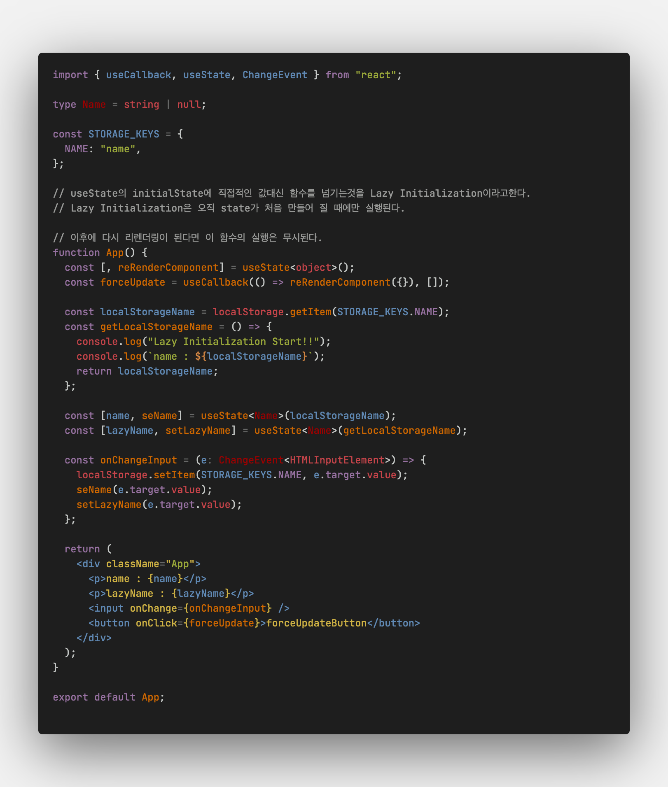
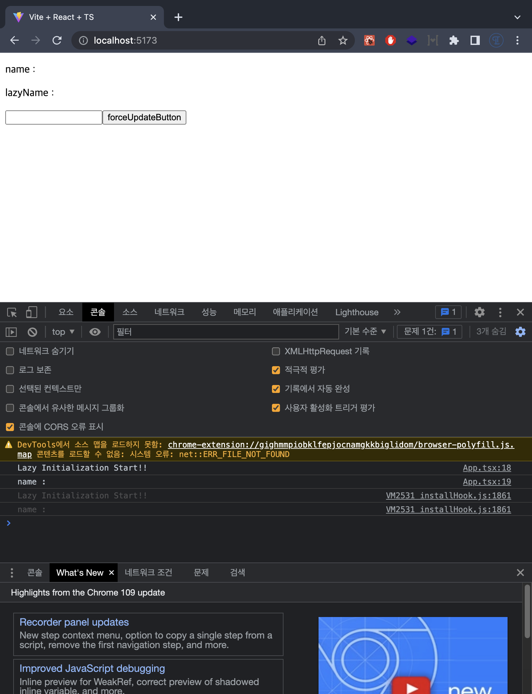

# Lazy initial State

useState의 initialState는 초기 렌더링 시에 사용하는 값이다.

```js
const [state, setState] = useState(initialState);
```

위에서 초기 렌더링 시에만 사용되는 값!이라고 설명하였다.

그렇다면 initialState를 함수로 전달한다면 어떻게 될까?



위의 예시는 로컬스토리지에 `name`이라는 키값이 있다면


