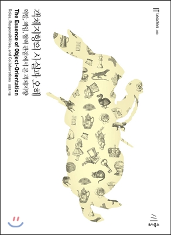

## 객체지향과 인지능력

주위를 둘러보면 객체라고 부를 수 있는 다양한 존재를 볼 수 있다. 길을 걷는 사람들, 도로위를 미끄러지듯 지나가는 자동차, 도시의 적막함을 감싸주는 푸른 가로수, 책상 위에 놓여진 컴퓨터와 모니터까지, 하나의 단위로 인식할 수 있고 다른 사물과 구분할 수 있는 모든것들이 모여 객체의 스펙트럼을 형성한다.

객체 지향 패러다임이 인간이 인지할 수 있는 다양한 객체들이 모여 현실 세계를 이루는 것처럼 소프트웨어의 세계 역시 인간이 인지할 수 있는 다양한 소프트웨어 객체들이 모여 이뤄져 있다는 믿음에서 출발한다. 그러나 현실과 소프트웨어 안의 세계의 유사성은 여기까지다. 객체지향 패러다임의 목적은 현실세계를 모방하는것이 아닌 현실세계를 기반으로 새로운 세계를 창조 하는것이다.

현실세계의 전등은 사람의 손길 없이는 스스로 불을 밝힐수 없지만 소프트웨어의 전등은 외부의 도움없이도 스스로 전원을 켜거나 끌 수 있다. 실행 중인 객체지향 애플리케이션의 내부를 들여다볼 수 있다면 겉으로는 우리가 알고 있는 세계와 유사해 보이지만 본질적으로 매우 이질적인 모습을 지닐것이다.

## 객체 그리고 이상한 나라

책에서 이상한나라의 앨리스 소설의 한 부분을 소개한다.

> 앨리스는 버섯을 먹으면 키가 줄기도, 늘기도하며 키가 얼마나 크냐 작냐에 따라 문을 열고 다른 곳으로 이동할수있다.

### 앨리스 객체

앨리스는 정원으로 통하는 문을 통과하기에 적당한 상태로 키를 계속해서 변화시켰다. 문을 통과하기에 적당한 상태란 문을 통과하기에 적절한 키의 값을 의미한다. 따라서 특정 시점의 앨리스의 상태란 특정 시점에서의 앨리스의 키를 의미한다.

앨리스의 키는 계속변화하는데 아무런 이유없이 변하는것이 아니다. 앨리스의 키는 앨리스가 특정한 행동을 했기떄문에 변화하게된다. 결국 앨리스의 키를 변화시키는 것은 앨리스의 **행동**이다. 행동에 따라 상태가 변하게 되는것이다.

앨리스의 상태를 결정하는건 행동이지만, 행동의 결과를 결정하는것은 상태다. 앨리스의 키가 130센티미터일때 케이크를 먹고 키가 20센티가 늘어나 150센티미터가 되었을때 케이크를 먹은 행동의 결과는 150센티미터가 되었다는것이다. 150센티미터가 되는것을 결정한것은 이전 상태인 130센티미터의 키를 가진 앨리스의 상태다.

어떤 행동의 성공 여부는 이전에 어떤 행동들이 발생했었는지에 대해서도 영향을 받는다는 사실도 알아야한다. 앨리스가 문을 통과하기위해서는 통과할 수 있을 정도로 충분히 키를 줄여야한다.

이것은 행동간의 순서가 중요하다는것을 의미한다. 문을 통과하려는 행동의 성공을 위해서는 키를 줄이는 행동이 선행되어야만한다.

앨리스를 그저 객체로 바라보자. 객체의 상태가 변경되더라도 그 객체가 변함없이 같은 객체라는 사실은 변하지않는다. 그러므로 객체는 상태변경과 무관하게 유일한 존재로 식별이 가능하다.

- 객체는 상태를 가지며 상태는 변경이 가능하다.
- 객체의 상태를 변경시키는것은 객체의 행동이다.
  - 행동의 결과는 상태에 의존적이며 상태를 이용해 서술할 수 있다.
  - 행동의 순서가 결과에 영향을 끼친다.
- 객체는 어떤 상태에 있더라고 유일하게 식별이 가능하다.

## 객체, 그리고 소프트웨어

하나의 식별가능한 물리적인 또는 개념적인 사물은 어떤것이라도 객체라고 할 수 있다. 객체의 다양한 특성을 효과적으로 설명하기 위해 객체를 상태(state), 행동(behavior), 식별자(identity)를 지닌 실체로 보는것이 가장 효과적이다.

### 상태

객체가 주변 환경과의 상호작용에 어떻게 반응하는가는 그 시저마지 객체에게 어떤 일이 일어났었는가에 따라 달라진다. 앨리스가 문을 통과하기 위해서 부채질이나 버섯한쪽을 먹어 키를 줄여아만 한다. 문을 통과한다는 행동의 결과를 예측할 수 있는 단 하나의 방법은 과거의 앨리스가 취한 행동이다. 그러나 이 방법은 앨리스가 과거에 했던 모든 행동을 기억해내야만 가능하기에 행동의 결과를 설명하는것을 매우 어렵게 만든다.

하지만 상태를 이용하면 과거의 모든 행동 이력을 설명하지 않고도 행동의 결과를 쉽게 예측할수있다.

#### 상태와 프로퍼티

앨리스는 객체다. 앨리스의 키를 줄이기위한 재료인 음료 케이크 부채 버섯 모두 객체다. 이들은 뚜렷한 경계를 가지며 식별이 가능하고 상태와 행동을 지니고있다.

하지만 앨리스의 키와 위치는 객체가 아니다. 음료수의 양도 객체가 아니다.

숫자, 문자열, 양, 속도, 시간, 날짜, 참/거짓과 같은 단순한 값들은 객체가 아니다. 단순한 값들은 그 자체로 독립적인 의미를 가지기보다는 다른 객체의 특성을 표현하는데 사용된다. 다시말해 다른 객체의 상태를 표현하기 위해 사용된다.

```
앨리스        ----      음료
키 : 130               양 : 0.5L
위치 : '통로'
```

앨리스와 음료는 객체다. 키, 위치, 양은 객체가 아닌 단순한 값이다. 따라서 앨리스의 상태는 키와 위치라는 단순한 값으로 표현할 수 있다.
앨리스는 키가 130센티미터이고 위치는 통로이며 0.5L 크기의 음료를 가지고있다.

결론적으로 모든 객체의 상태는 단순한 값과 객체의 조합으로 표현할 수 있다. 이떄 객체의 상태를 구성하는 모든 특징을 객체의 프로퍼티라고 한다. 일반적으로 프로퍼티는 변경되지않고 고정되기 때문에 정적이다. 반면 프로퍼티 값은 시간이 흐름에따라 변경되기 때문에 동적이다.

위에서 앨리스는 음료를 가지고있다. 객체와 객체 사이의 의미있는 연결을 링크라고한다. 객체와 객체 사이에는 링크가 존재해야만 요청을 보내고 받을 수 있다. 즉 객체의 링크를 통해서만 메시지를 주고 받을 수 있다. 링크가 존재하지않으면 협력이 불가능한것이다.

링크는 객체가 다른 객체를 참조할 수 있다는것을 의미한다. 이는 한객체가 다른 객체의 식별자를 알고 있다는 것이다. 객체간의 선으로 표현되는 링크와 달리 객체를 구성하는 값은 속성이라고 한다. 앨리스의 키와 위치는 단순한 값으로 표현되기때문에 속성이다.

객체의 프로퍼티는 단순한값인 속성과 다른 객체를 가리키는 링크라는 두 종류의 조합으로 표현이 가능하다.

객체는 자율적인 존재다. 자율적인 존재는 자신의 상태를 책임져야한다. 외부의 객체가 직접적으로 객체으 상태를 주무를 수 없다면 간접적으로 객체의 상태를 변경하거나 조회할 수 있는 방법이 필요하다.

### 행동

객체의 상태를 변경하는 것은 객체의 자발적인 행동 뿐이다.

객체가 취하는 행동은 객체 자신의 상태를 변경시킨다. 이는 Side Effect를 초래한다는것을 의미한다.

상태와 행동 사이에는 아래와 같은 관계가있다.

- 객체의 행동은 상태에 영향을 받는다.
- 객체의 행동은 상태를 변경시킨다.

이것은 상태라는 개념을 이용해 행동을 두가지 관점에서 서술할 수 있음을 의미한다.

- 상호작용이 현재의 상태에 어떤 방식으로 의존하는가
- 상호작용이 어떻게 현재의 상태를 변경시키는가

#### 협력과 행동

객체는 자신에게 주어진 책임을 완수하기 위해 다른 객체를 이용하고 다른 객체에게 서비스를 제공한다. 객체는 다른 객체와 적극적으로 상호작용하며 '협력하는 객체들의 공동체'에 참여하기 위해 노력한다.

객체는 다른 객체와 메시지를 통해서만 의사소통을 할 수 있다. 객체가 어떤 행동을 하도록 만드는 것은 객체가 외부로부터 수신한 메시지다. 객체는 수신된 메시지에 따라 적절히 행동하며 협력하고 그 결과로 자신의 상태를 변경한다.

장바구니라는 객체와 주문이라는 객체가 존재한다고 생각하고, 장바구니에 담긴 아이템들을 주문이라는 객체의 행동이 벌어지면 어떻게 될까?

주문이라는 행동에의해 장바구니의 상태인 아이템 리스트는 주문한 만큼 제거가 되어야한다.

객체는 협력에 참여한느 과정에서 자기 자신의 상태뿐만 아니라 다른 객체의 상태 변경을 유발할 수 도있다는것을 알수있다.

객체의 행동은 아래 두가지 관점의 부수효과를 명확하게 서술해야한다.

- 객체 자신의 상태 변경
- 행동 내에서 협력한느 다른 객체에 대한 메시지 전송

#### 상태 캡슐화

현실속의 앨리스는 능동적인 존재지만, 음료는 수동적인 존재다. 하지만 객체지향의 세계에서 모든 객체는 자신의 상태를 스스로 관리하는 자율적인 존재다.

앨리스가 음료를 마시는 행동은 앨리스 자신의 키를 작게만든다. 따라서 앨리스 자신의 상태를 변경하고 이 과정에서 자신이 먹은 만큼 음료의 양을 줄여달라고 메시지를 전송한다. 이것이 앨리스가 음료를 마신다는 행동에대한 모든것이다.

```
drinkBeverage()         drunken(quantity)
--------------->  앨리스  --------------->  음료
```

두 메시지를 보면 앨리스가 음료를 마시는 메시지인 `drinkBeverage()`, 음료에게 음료의 양이 줄어드는 메시지인 `drunken(quantity)`가 존재한다.

두 메시지를 보고 앨리스의 키가 줄어든다거나 음료의 양이 줄어든다는 상태 변경을 예상할 수 있나? 메시지의 송신자는 메시지 수신자의 상태변경에 대해서는 전혀 알지 못한다.

이것이 캡슐화다. 객체는 상태를 캡슐안에 감춰둔 채 외부로 노출하지 않는다. 객체가 외부에 노출하는것은 행동뿐이며 객체에 접근할 수 있는 방법 역시 행동뿐이다.

객체의 행동을 유발하는것은 외부로부터 전달된 메시지지만, 객체의 상태를 변경여부는 객체 스스로 결정한다. 송신자 즉 외부의 객체는 메시지를 수신하는 객체의 상태가 변경된다는 사실을 알지 못한다. 상태를 외부에 노출시키지 않고 행동을 경계로 캡슐화하는 것은 결과적으로 객체의 자율성을 높인다.

자율적인 객체는 스스로 판단하고 스스로 결정하기 때문에 객체의 자율성이 높아질수록 객체의 지능이 높아진다. 협력에 참여하는 객체들의 지능이 높아질수록 유연하고 간결해진다.

### 식별자

객체란 식별 가능한 경계를 가진 모든 사물을 의미한다. 모든 객체는 식별자를 가지며 식별자를 이용해 객체를 구별할 수 있다.

모든 객체가 식별자를 가진다는것은 반대로 객체가 아닌 단순한 값은 식별자를 가지지 않는다는것을 의미한다.

값은 숫자, 문자열, 날자, 시간, 금액 등과 같이 고정된 양을 모델링한다. 흔히 값의 상태는 변하지않기에 immutable State라고한다.

값의 동일 여부는 상태가 같은지를 이용해 판단한다. 값의 상태가 같다면 두 인스턴스는 동일한것으로 판단하고 상태가 다르다면 다른것으로 판단한다. 값의 상태는 결코 변하지 않기에 어떤 시점에 동일한 타입의 두 값이 같다면 언제까지라도 두 값은 동등한 상태를 유지할 것이다.

객체는 시간에따라 변경되는 상태를 포함하며 행동을 통해 상태를 변경한다. 따라서 mutable state라고한다. 타입이 같은 두객체의 상태가 완전 같더라도 두 객체는 독립적인 별개의 객체로 다뤄야한다.

식별자를 기반으로 객체가 같은지를 판단할 수 있는 성질을 **동일성**이라한다.

## 상태보다는 행동을 우선으로 설계하자

객체지향에 갓 입문한 사람들이 가장 쉽게 빠지는 함정이 상태를 중심으로 그 객체를 바라본다는점이다. 필요한 상태가 무엇인지 결정하고 그 상태에 필요한 행동을 결정한다.

안타깝게도 이런 습관은 설계에 악영향을 끼친다.

**첫째** 상태를 먼저 결정할 경우 캡슐화가 저해된다. 상태에 초점을 맞출경우 상태가 객체 내부로 깔끔하게 캡슐화되지 못하고 공용 인터페이스에 그대로 노출되버릴 확률이 높아진다.

**둘째** 객체를 협력자가아닌 고립된 섬으로 만든다. 객체가 필요한 이유는 애플리케이션 문맥내에서 다른 객체와 협력하기 위해서다. 상태를 먼저 고려한느 방식은 협력이라는 문맥에서 멀리 벗어나 설계함으로 자연스럽게 협력에 적합하지 못한 객체를 창조한다.

**셋째** 객체의 재 사용성이 저하된다. 객체의 재사용성은 다양한 협력에 참여할 수 있는 능력에서 나온다. 상태에 초점을 맞춘 객체는 다양한 협력에 참여하기 어렵기 때문에 재사용성이 저하될 수 밖에없다.

객체는 다른 객체와 협력하기 위해 존재한다. 객체의 행동은 객체가 협력에 참여하는 유일한 방법이다. 따라서 객체가 적합한지를 결정하는 것은 그 객체의 상태가 아니라 행동이다. 설계자로서 우리는 협력의 문맥에 맞는 적절한 행동을 수행하는 객체를 발견하거나, 창조해야한다.

우리가 애플리케이션 안에서 어떤 행동을 원하느냐가 어떤 객체가 적합한지를 결정한다. 객체의 적합성을 결정하는것은 상태가 아닌 행동임에 주의해야한다.
