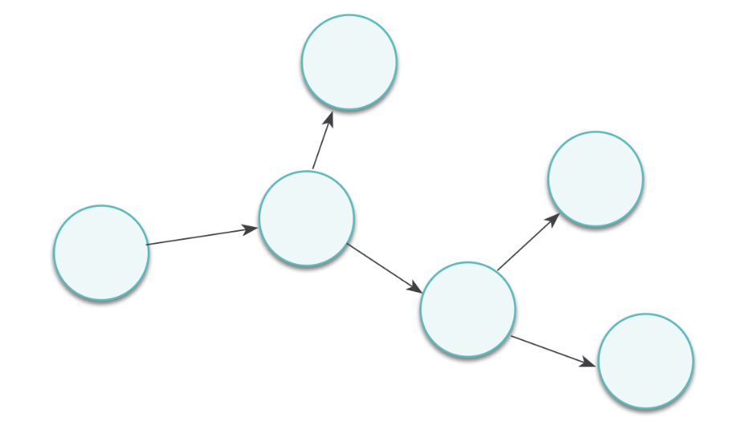
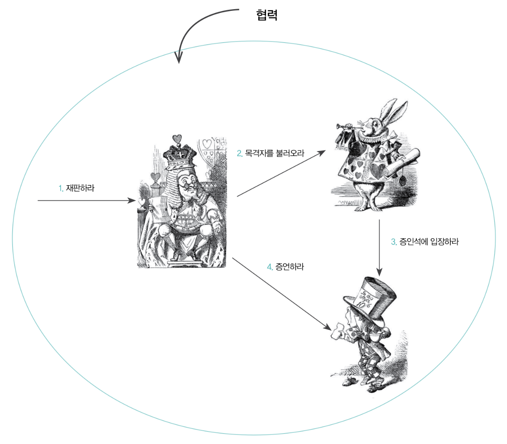
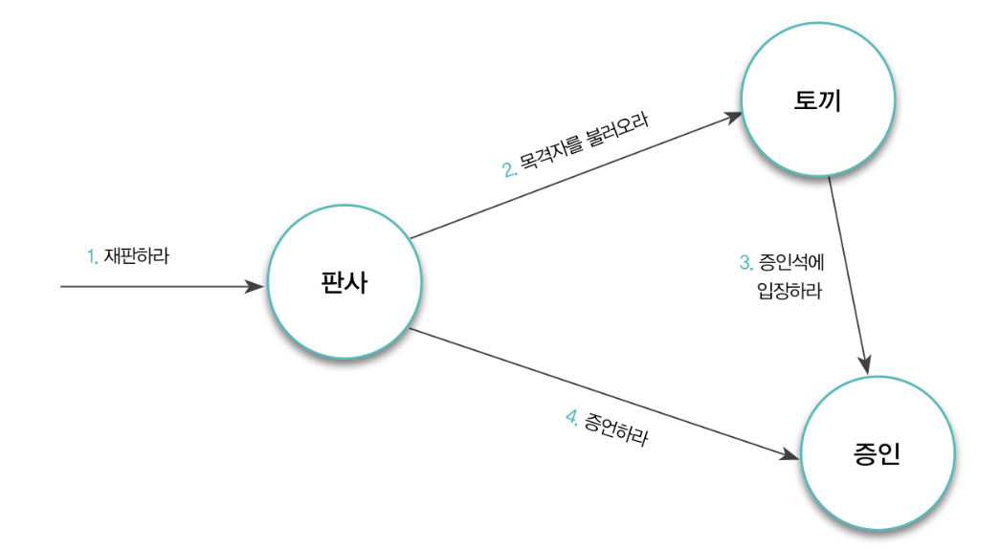

## 협력

협력의 본질은 요청과 응답으로 연결되는 사람들의 네트워크다. 이 과정 속에서 요청과 응답의 연쇄적인 흐름이 발생한다.

**협력**은 한 사람이 다른 사람에게 도움을 **요청**할때 시작된다. 자신에게 할당된 일이나 업무를 처리하던 중에 스스로 해결하기 어려운 문제에 부딪히게 되면 문제를 해결하는데 필요한 지식을 알고 있거나 도움을 받을 수 있는 누군가에게 도움을 요청하게 된다.

요청을 받은 사람은 일을 처리한 후 요청한 사람에게 필요한 지식이나 서비스를 제공하는 것으로 요청에 응답한다.

중간에 앨리스얘기가 나온다. 모자장수가 재판을 받고 왕이 재판을하며, 하얀토끼가 모자장수를 데리고 오는 이야기다.

여기서도 **협력**이 나온다

- 누군가 왕에게 재판을 요청하며 재판이 시작된다.
- 왕이 하얀 토끼에게 증인을 부를 것을 요청한다.
- 왕의 요청을 받은 토끼는 모자 장수에게 증인석으로 입장할 것을 요청한다.
- 모자 장수는 증인석에 입장함으로써 토끼의 요청에 응답한다.
- 모자 장수의 입장은 왕이 토끼에게 요청했던 증인 호출에 대한 응답이기도 하다.
- 이제 왕은 모자 장수에게 증언할 것을 요청한다.
- 모자 장수는 자신이 알고 있는 내용을 증언함으로써 왕의 요청에 응답한다.

## 책임

객체지향의 세계에서는 어떤 객체가 어떤 요청에 대해 대답해 줄 수 있거나, 적절한 행동을 할 의무가 있는 경우 해당 객체가 책임을 가진다고 말한다.

앨리스 이야기에서 **왕**은 `재판을 수행하라`라는 요청에 응답해야 하므로 `재판을 수행할` 책임을 지닌다. **하얀토끼**는 `목격자를 데려오라`라는 요청에 응답해야 하므로 `목격자를 불러올` 책임을 지니고, **모자장수**는 `재판장에 오고 증언을 해라`라는 요청에 응답해야 하므로 `재판장에와서 증언을 해야한다`라는 책임이 있다.

### 책임의 분류

- 하는것 doing
  - 객체를 생성하거나 계산을 하는 등의 스스로 하는것
  - 다른 객체의 행동을 시작하는것
  - 다른 객체의 활동을 제어하고 조절하는것
- 아는것 knowing
  - 개인적인 정보에 대해 아는것
  - 관련된 객체에 관해 아는것
  - 자신이 유도하거나 계산할 수 있는 것에 관해 아는것

책임은 객체지향 설계의 품질을 결정하는 가장 중요한 요소다. 객체지향 설계의 예술은 적절한 객체에게 적절한 책임을 할당하는데 있다. 책임이 불분명한 객체들은 애플리케이션의 미래 역시 불분명하게 만든다. 명확한 책임이 애플리케이션의 미래를 결정짓는다는 것을 명심하자.

### 책임과 메시지

협력 안에서 객체는 다른 객체로부터 요청이 전송됐을 경우에만 자신에게 주어진 책임을 수행한다. 한 객체가 다른 객체에게 전송한 요청은 그 요청을 수신한 객체의 책임이 수행되게 한다. 이처럼 객체가 다른 객체에게 주어진 책임을 수행하도록 요청을 보내는것을 **메시지 전송(message-send)** 라고한다. 메시지는 협려을 위해 한 객체가 다른 객체로 접근할 수 있는 유일한 방법이다.

설계를 시작하는 초반에는 어떤 객체가 어떤 책임을 가지고 어떤 방식으로 서로 협력해야 하는지에 대한 개요를 아는 것만으로도 충분하다. 책임과 협력의 구조가 자리를 잡기 전까지는 책임을 구현하는 방법에 대한 고민은 잠시 뒤로 미루는것이 좋다.

객체 지향 설계는 협력에 참여하기 위해 어떤 객체가 어떤 책임을 수행해야 하고 어떤 객체로부터 메시지를 수신할 것인지를 결정하는 것으로부터 시작된다. 어떤 클래스가 필요하고 어떤 메서드를 포함해야 하는지를 결정하는 것은 책임과 메시지에 대한 대략적인 청사진을 그리고 난 후 해도 늦지 않는다.

## 역할

어떤 객체가 수행하는 책임의 집합은 객체가 협력 안에서 수행하는 역할을 암시한다. 역할은 재사용 가능하고 유연한 객체지향 설게를 낳는 매우 중요한 구성요소이기 때문이다.

앨리스의 이야기에서 왕이 여왕에게 재판을 보라고 요청하고, 증인석의 인물이 모자장수에서 요리사로 바뀌었다. 이 들간의 협력을 별도로 관리하고 유지해야할까? 그럴필요 없이 재판이라는 협력 과정에서 **역할(role)** 을 사용하면 모든 협력을 포괄할 수 있는 하나의 협력으로 추상화가 가능하다.

역할은 협력 내에서 다른 객체로 대체할 수 있음을 나타내는 일종의 표식이다. 동일한 역할을 수행할 수 있다는 것은 해당 객체들이 협력 내에서 동일한 책임의 집합을 수행할 수 있다는 것을 의미한다. 동일한 역할을 수행할 수 있다는 것은 매우 중요한 개념이다.

역할은 객체지향 설계의 **단순성(simplicity)** **유연성(flexibility)** **재사용성(reusability)** 을 뒷받침하는 핵심 개념이다.

### 협력의 추상화

역할의 가장 큰 가치는 하나의 협력 안에 여러 종류의 객체가 참여할 수 있게 함으로써 협력을 추상화할 수 있다는 점이다. 협력의 추상화는 설계자가 다뤄야하는 협력의 개수를 줄이는 동시에 구체적인 객체를 추상적인 역할로 대체함으로써 협력의 양상을 단순화한다.

역할을 이용하면 협력을 추상화함으로써 단순화 할 수 있다. 구체적인 객체로 추상적인 역할을 대체해서 동일한 구조의 협력을 다양한 문맥에서 재사용할 수 있는 능력은 과거의 전통적인 패러다임과 구분되는 객체지향만의 힘이다.

### 대체가능성

본질적으로 역할은 다른 객체에 의해 대체 가능함을 의미한다. 역할을 대체하기 위해서는 행동이 호환돼야 한다는 점을 알아야한다.

객체지향 용어를 빌려 설명하면 객체가 역할을 대체 가능하기 위해서는 협력 안에서 역할이 수행하는 모든 책임을 동일하게 수행할 수 있어야한다.

객체는 역할이 암시하는 책임보다 더 많은 책임을 가질 수 있다. 따라서 대부분의 경우에 객체의 타입과 역할 사이에는 **일반화/특수화 관계** 가 성립하는 것이 일반적이다. 역할이 협력을 추상적으로 만들 수 있는 이유는 역할 자체가 객체의 추상화이기 때문이다.

## 객체의 모양을 결정하는 협력

### 흔한 오류

데이터를 저장하기 위해 객체가 존재한다는 선입견은 나쁘다. 객체가 상태의 일부로 데이터를 포함하는것은 사실이지만 데이터는 객체가 행위를 수행하는데 필요한 일부일뿐이다. 객체가 존재하는 이유는 행위를 수행하며 협력에 참여하기 위해서다.

객체지향이 클래스간의 관계를 표현하는 시스템의 정적인 측면에 중점을 둔다는 선입견도 나쁘다. 중요한건 정적인 클래스가 아닌 협력에 참여하는 동적인 객체이며 클래스는 단지 시스템에 필요한 객체를 표현하고 생성하기 위해 프로그래밍 언어가 제공하는 구현 메커니즘이라고 생각하면된다.

### 협력을 따라 흐르는 객체의 책임

올바른 객체를 설계하기 위해서는 먼저 견고하고 깔끔한 협력을 설계해야 한다. 협력을 설계한다는 것은 설계에 참여하는 객체들이 주고받을 요청과 응답의 흐름을 결정한다는 것을 의미한다. 이렇게 결정된 요청과 응답의 흐름은 객체가 협력에 참여하기 위해 수행될 책임이 된다.

객체에게 책임을 할당하고 나면 책임은 객체가 외부에 제공하게 될 행동이 된다. 협력이라는 문맥에서 객체가 수행하게 될 적절한 책임, 즉 행동을 결정한 후에 그 행동을 수행하는 데 필요한 데이터를 고민해야한다. 객체가 협력에 참여하기 위해 필요한 데이터와 행동이 어느 정도 결정된 후에 클래스의 구현 방법을 결정해야한다.

객체의 행위에 초점을 맞추기 위해서는 협력이라는 실행 문맥안에서 책임을 분배해야 한다. 각 객체가 가져야 하는 상태와 행위에 대해 고민하기 전에 그 객체가 참여할 문맥인 협력을 정의하라. 객체지향 시스템에서 가장 중요한것은 충분히 자율적인 동시에 충분히 협력적인 객체를 창조하는 것이다. 이 목표를 달성할 수 있는 가장 쉬운 방법은 객체를 충분히 협력적으로 만든 후에 협력이라는 문맥 안에서 자율적으로 만드는 것이다.
