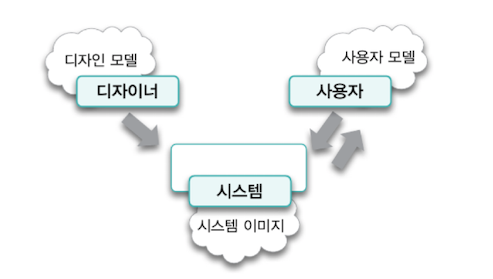
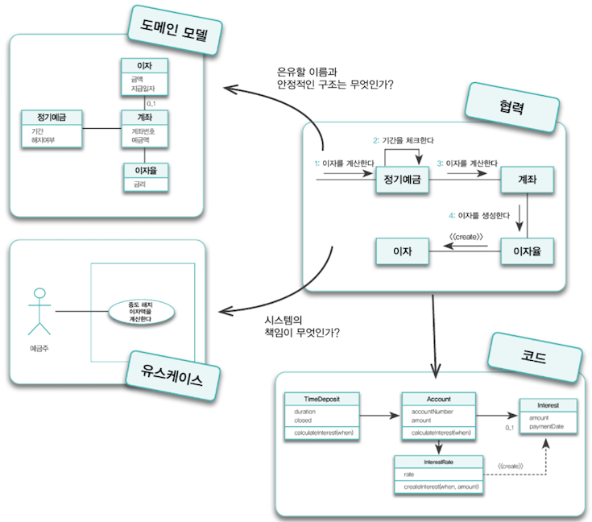

## 기능 설계, 구조 설계

기능 측면의 설계란 제품이 사용자를 위해 무엇을 할 수 있는지에 초점을 맞추는 설계고, 구조 측면의 설계란 제품의 형태가 어떠해야 하는지에 초점을 맞춘다.

훌륭한 기능이 훌륭한 소프트웨어를 만드는 충분조건이라하면 훌륭한 구조는 훌륭한 소프트웨어를 만들기위한 필수 조건이다.

불행하게도 만고불변의 진리는 요구사항은 변경된다는것이다. 설계가 어려운 이유가 요구사항이 변경될지도 모르는데 수용할 수 있는 코드를 작성해야하기 때문이다.  
미래의 변경에 대비할순 있지만 변경을 예측할 수는 없다. 미래에 대비하는 가장 좋은 방법은 변경을 예측하는게 아닌 변경을 수용할 수 있는 선택의 여지를 설계에 마련해 놓는 것이다

## 두가지 재료: 기능과 구조

-   기능 : 사용자가 자신의 목표를 달성하기 위해 사용할 수 있는 시스템의 서비스
-   구조 : 시스템의 기능을 구현하기 위한 기반으로 기능 변경을 수용할 수 있도록 안정적이어야 한다.

일반적으로 기능을 수집하고 표현하기 위한 기법을 **유스케이스 모델링**이라고 하고 구조를 수집하고 표현하기 위한 기법을 **도메인 모델링**이라고 한다.

## 안정적인 재료: 구조

소프트웨어를 사용하는 유저들은 자신이 관심을 가지고 있는 특정한 분야의 문제를 해결하기 위해 소프트웨어를 사용한다.

이처럼 유저가 프로그램을 사용하는 대상 분야를 **도메인**이라고 한다.

도메인 모델에서 모델이란 대상을 단순화해서 표현한것이다. 모델은 지식을 선택적으로 단순화하고 의식적으로 구조화한 형태다. 즉 대상을 추상화하고 단순화 한것이다.

도메인 모델은 이해관계자들이 바라보는 멘탈 모델이다. 멘탈 모델이란 사람들이 자기 자신, 다른사람, 환경, 자신이 상호작용하는 사물들에 대해 갖는 모형이다.

최종 코드는 유저가 도메인을 바라보는 관점을 반영해야한다. 이것은 애플리케이션이 도메인 모델을 기반으로 설계되어야한다는 것을 의미한다. 도메인 모델이란 사용자들이 도메인을 바라보는 관점이고 설계자가 시스템의 구조를 바라보는 관점인 동시에 소프트웨어 안에 구현된 코드의 모습 그 자체이기 때문이다.

### 표현적 차이

소프트웨어 객체는 현실 객체에 대한 추상화가 아닌 은유를 기반으로 재창조한것이다. 따라서 현실 객체가 갖지못한 특성을 가질수도있고 현실 객체가 하지 못하는 행동을 할 수도 있다.

은유를 통해 투영해야하는 대상은 바로 유저가 도메인에 대해 생각하는 개념들이라 한다.

따라서 소프트웨어 객체는 그 대상이 현실적인 혹은 현실적이지 않은지에 대해 상관없이 도메인 모델을 통해 표현되는 도메인 객체들을 은유해야한다.

### 불안정한 기능을 담는 안정적인 도메인 모델

도메인모델이 제공하는 구조는 비교적 안정적이다. 도메인 모델의 핵심은 유저가 도메인을 바라보는 관점을 반영해 소프트웨어를 설계하고 구현하는것인데 유저는 누구보다 도메인의 본질적인 측면을 가장 잘 이해하고 있기때문이다.

## 불안정한 재료: 기능

### 유스케이스

유저는 자신의 목표를 달성하기 위해 시스템과의 상호작용을 시작한다. 사용자가 시스템에게 작업을 요청하면 시스템은 요청을 처리한 후 사용자에게 원하는 결과를 제공한다. 사용자는 시스템의 응답을 기반으로 또 다른 작업을 요청하고 시스템은 요청을 다시 처리 한 후 사용자에게 응답한다.

이처럼 유저의 목표를 달성하기 위해 사용자와 시스템 간에 이뤄지는 상호작용의 흐름을 텍스트로 정리한 것을 유스케이스라고한다.

유스케이스의 가치는 유저의 목표를 중심으로 시스템의 기능적인 요구사항들을 이야기 형식으로 묶을 수 있다는 점이다.

### 유스케이스의 특성

1. 유스케이스는 유저와 시스템 간의 상호작용을 보여주는 텍스트다
2. 유스케이스는 하나의 시나리오가 아니라 여러 시나리오들의 집합이다.  
   (시나리오는 유스케이스를 통해 시스템을 사용하는 사나의 특정한 이야기 또는 경로다)
3. 유스케이슨느 단순한 피처(feature) 목록과 다르다. 피처는 시스템이 수행해야 하는 기능의 목록을 단순하게 나열한 것이다.
4. 유스케이스는 유저 인터페이스와 관련된 세부 정보를 포함하지 말아야 한다.
5. 유스케이스는 내부 설계와 관련된 정보를 포함하지 않는다.  
   유스케이스의 목적은 연관된 시스템의 기능을 이야기형식으로 모으는것이지 내부 설계를 설명하는것이 아니다.

#### 유스케이스는 설계 기법도 객체지향 기법도 아니다

유스케이스는 시스템의 내부 구조나 실행 메커니즘에 관한 어떤 정보도 제공하지 않는다. 유스케이스는 단지 사용자가 시스템을 통해 무엇을 얻을 수 있고 어떻게 상호작용할 수 있느냐에 관한 정보만 기술된다

시스템이 외부에 제공해야 하는 행위만 포함하는 유스케이스이기 때문에 시스템의 내부 구조를 유추할 수 있는 방법은 존재하지 않는다.

## 재료 합치기: 기능과 구조의 통합

### 도메인 모델, 유스케이스, 그리고 책임 주도 설계

변경에 유연한 소프트웨어를 만들기 위해서는 유스케이스에 정리된 시스템의 기능을 도메인 모델을 기반으로 한 객체들의 책임으로 분배해야한다.

객체지향 패러다임은 모든 것이 객체라는 사상에서 출발한다. 유스케이스에 명시된 기능을 구현하는 프로그래머는 시스템을 사용자로부터 전송된 메시지를 수행하기 위해 책임을 수행하는 거대한 자율적인 객체로 본다.

시스템은 사용자와 만나는 경계에서 사용자의 목표를 만족시키기 위해 사용자와의 협력에 참여하는 커다란 객체고, 사용자에게 시스템이 수행하기로한 약속한 기능은 결국 시스템의 책임으로 볼 수 있다

사용자의 관점에서 객체는 자신이 전송한 메시지에 응답하는데 필요한 책임을 다하는 일종의 객체다.

시스템이라는 객체 안에는 더 작은 규모의 객체가 포함될 수 있다. 시스템이 수행해야 하는 커다란 규모의 책임은 시스템 안에 살아가는 작은 크기의 객체들간의 협력을 통해 구현될 수 있다.

책임 주도 설계는 이 지점부터 적용이된다.

시스템에 할당된 커다란 책임은 이제 시스템안의 작은 규모의 객체들이 수행해야 하는 더 작은 규모의 책임으로 세분화된다. 
도메인 모델에 포함된 개념을 은유하는 소프트웨어 객체를 선택해야한다. 협력을 완성하는데 필요한 메시지를 식별하면서 객체들에게 책임을 할당해 나간다. 마지막으로 협력에 참여하는 객체를 구현하기 위해 클래스를 추가하고 속성과 함께 메서드를 구현하면 시스템의 기능이 완성된것이다.

> **객체 설계는 다음과 같이 표현되기도 한다.**  
> 요구사항들을 식별하고 도메인 모델을 생성한 후, 소프트웨어 클래스에 메서드들을 추가하고 요구사항을 충족시키기 위해 객체들 간의 메시지 전송을 정의하라

유스케이스는 사용자에게 제공할 기능을 시스템의 책임으로 보게 함으로써 객체 간의 안정적인 구조에 책임을 분배할 수 있는 출발점을 제공한다. 도메인 모델은 기능을 수용하기 위해 은유할 수 있는 안정적인 구조를 제공한다.

책임-주도 설계는 유스케이스로부터 첫번째 메시지와 사용자가 달성하려는 목표를 도메인 모델로부터 기능을 수용할 수 있는 안정적인 구조를 제공받아 실제로 동작하는 객체들의 협력 공동체를 창조한다.

책임-주도 설계를 위해 유스케이스와 도메인 모델이 반드시 필요한것은 아니다. 그리고 유스케이스와 도메인모델이 책임-주도 설계만을 위해 사용되는것도 아니다. 여기서 중요한것은 견고한 객체지향 애플리케이션 개발을위해 사용자의 관점에서 시스템의 기능을 명시하고 사용자와 설계자가 공유하는 안정적인 구조를 기반으로 기능을 책임으로 변환하는 체계적인 절차를 따라야 한다는 것이다.

## 기능 변경을 흡수하는 안정적인 구조

도메인 모델이 안정적인 이유는 아래와 같다

-   도메인 모델을 구성하는 개념은 비즈니스가 없어지거나 완전히 개편되지 않는 한 안정적으로 유지된다. 정기예금 도메인에서 **정기예금**과 **계좌, 이자율, 이자**란 개념은 정기예금이란 금융상품이 없어지거나 완전히 개편되지 않는 한 안정적으로 유지되는 개념이다.
-   도메인 모델을 구헝하는 개념 간의 관계는 비지니스 규칙을 기반으로 하기 때문에 비지니스 정책이 크게 변경되지 않는 한 안정적으로 유지된다. 정기예금 도메인에서 이자는 정기예금이 만기가 되거나 중도 해지를 하는 경우에 한해서 단 한번 지급된다. 따라서 계좌와 이자간의 관계는 이와 같은 핵심적인 비지니스 규칙이 변경되지 않는 한 동일하게 유지된다.

도메인 모델 중심으로 객체 구조를 설계하고 유스케이스의 기능을 객체의 책임으로 분배하는 객체지향 설계 방식의 유연함을 잘 사용하면 기능적인 요구사항이 변경 될 경우 책임과 객체 간의 대응관계만 수정될 뿐 이다.
