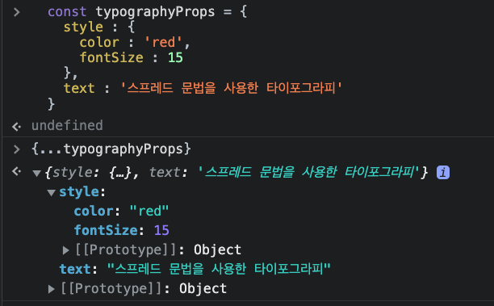
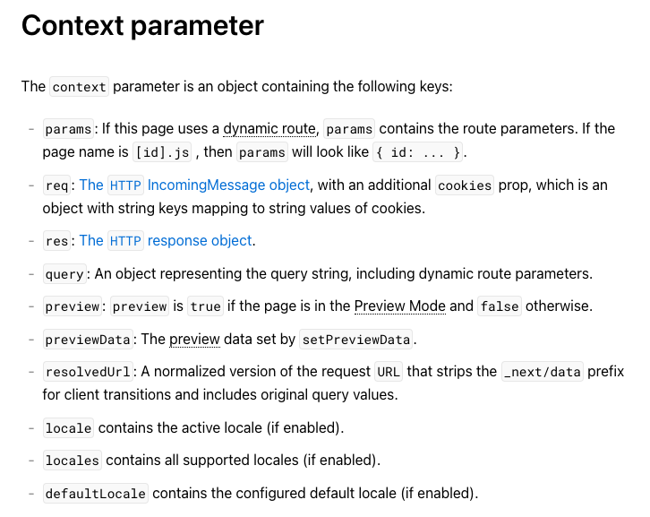

# 6장

## 디스트럭처링

### Destructuring assignment

mdn에서는 아래와 같이 정의한다.

> 디스트럭처링(구조분해) 할당 문법은 배열의 값 또는 객체의 속성을 풀어서 별개의 변수로 사용 할 수 있게 해주는 자바스크립트 표현식이다.

### 객체 구조분해할당

```js
var person = {
	name: '빡준',
	age: 28,
}

var name = person.name
var age = person.age
```

ES6이전에는 이런 방법을 사용했었다.

하지만 ES6부터는 아래와 같은 방법으로 사용한다.

```js
const person = {
	name: '빡준',
	age: 28,
}

const { name, age } = person
```

변수의 이름을 객체의 속성과 동일하게 지정하지않고 다른 이름을 사용할수도있다.

기본값도 지정해줄수도있다.

```js
const { name: userName } = person

const { name: useName = '빡준'}
```

### 배열 구조분해할당

```js
const ArrayForMe = ['빡준', 28, 'FrontEnd Developer']

const [name, age] = ArrayForMe
console.log(name, age) // "빡준", 28
```

나머지 값을 얻고싶다면 `rest operator`를 사용하면된다.

```js
const ArrayForMe = ['빡준', 28, 'FrontEnd Developer', '나머지값']

const [name, age, ...rest] = ArrayForMe
console.log(name, age, rest) // "빡준", 28 , ["FrontEnd Developer", "나머지값"]
```

<hr />

# 7장

## 루프

for ... of 명령문은 반복가능한 객체(Array, Map, Set, String, TypedArray, arguments 객체 등등)에 대해서 반복하고 각 개별 속성값에 대해 실행되는 문이 이있는 사용자 정의 반복 후크를 호출하는 루프를 생성한다.

```js
/**
 * @variable : 각 반복에 서로 다른 속성값이 variable에 할당된다.
 * @iterable : 반복되는 열거가능한 속성이 있는 객체
 */
for (variable of iterable) {
	statement
}
```

```js
// Array에 대한 반복
const iterable = [10, 20, 30]
for (const variable of iterable) {
	console.log(variable)
}
// 10, 20, 30

// String에 대한 반복
const iterable = 'BBAKJUN'
for (const variable of iterable) {
	console.log(variable)
}
// "B", "B", "A", "K", "J", "U", "N"

// TypedArray에 대한 반복
const iterable = new Uint8Array([0x00, 0xff])
for (const variable of iterable) {
	console.log(variable)
}
// 0, 255

// Map에 대한 반복
const iterable = new Map([
	['name', 'BBAK_JUN'],
	['age', 28],
])
for (const variable of iterable) {
	console.log(variable)
}
// ["name", "BBAK_JUN"], ["age", 28]

// Set에 대한 반복
const iterable = new Set([1, 1, 2, 2, 3, 3])
for (const variable of iterable) {
	console.log(variable)
}
// 1, 2, 3

// DocumentCollections에 대한 반복
const currentItems = document.querySelectorAll('li.current_item')
for (const item of currentItems) {
	item.classList.add('text-red')
}
// NodeList와 같은 DOM컬렉션에대해 반복할때 클래스를 추가할수도있다.
```

### `for ...of`와 `for ...in`의 차이

for ...in 루프는 객체의 모든 열거가능한 속성에 대해 반복한다.

```js
for (variable in iterable) {...}
```

variable : 매번 반복마다 다른 속성이름이 변수로 지정된다.<br/>
object : 반복작업을 수행할 객체로 열거형 속성을 가지고 있는객체

for ...in 문은 객체 자체의 <span style='color:red;'>모든 열거 가능한 속성들과 프로토타입 체인으로부터 상속받은 속성들</span>에 대해 반복한다.<br/>
더 가까운 프로토타입 속성들이 프로토타입 체인 객체로부터 더 멀리 떨어진 프로토타입의 속성보다 더 우선한다.

for ...of 구문은 컬렉션 전용이다. 모든 객체보다는 [Symbol.iterator] 속성이 있는 모든 컬렉션 요소에 대해 이방식으로 반복한다.

아래에서 둘의 차이를 알수있다.

```js
Object.prototype.objCustom = () => {}
Array.prototype.arrCustom = () => {}

let iterable = [100, 200, 300]
iterable.name = 'BBAK_JUN'

for (const i in iterable) {
	console.log(i) // 0, 1, 2, "name", "arrCustom", "objCustom"
}

for (const i of iterable) {
	console.log(i) // 100, 200, 300
}
```

<hr />

# 8장

## 배열 메서드

책에는 배열메서드만 나오지만 배열에대해 좀 더 알아보려한다.

> JavaScript의 Array 클래스는 리스트 형태의 고수준 객체인 배열을 생성할떄 사용하는 전역 객체입니다.

배열은 리스트와 비슷한 객체로서 순회와 변형 작업을 수행하는 메서드를 갖는다. Javascript 배열은 길이도, 각 요소의 자료형도 고정되어있지 않다. 배열의 길이가 언제든지 늘어나거나 줄어들 수 있고 데이터를 연속적이지 않은 곳에 저장할 수 있으므로 배열의 밀집성을 보장하지 않는다.

```js
const fruits = ['사과', '바나나']

const newFruits = fruits
fruits[0] = '그린애플'
console.log(newFruits) // ["그린애플", "바나나"]
```

배열을 새로운 변수에 할당하더라도 배열이 복사되지는 않는다. 그 이유는 새로운 변수에는 원본 배열을 가리키는 참조만 할당되기 때문이다.

배열의 복사본을 만들기 위해선 새 배열을 위한 변수를 생성하고, 원본 배열 각각의 `원시 요소`에 대해서도 새로운 변수를 생성해야한다.<br/>
Javascript에서는 이를 위해 아래와 같은 방법을 사용할 수 있다.

```js
const shallowCopyWithSpread = [...fruits]
const shallowCopyWithSlice = fruits.slice()
const shallowCopyWithFrom = Array.from(fruits)
```

위 세 코드는 모두 `얕은 복사`를 생성한다.

얕은 복사란 배열의 최상위 요소가 원시 값일 경우 복사하지만, 중첩 배열이나 객체 요소의 경우에는 원본 배열의 요소를 참조하게 된다.

### 정적 메서드

#### Array.from()

> 유사 배열 또는 반복 가능한 객체로부터 새로운 Array 인스턴스를 생성한다.

#### Array.isArray()

> 만약 배개변수가 배열이면 참, 아니면 거짓을 반환한다.

#### Array.of()

> 매개변수의 수와 자료형에 제한없이, 지정한 값을 사용해 새로운 Array 인스턴스를 생성한다.

#### Array.reduce()

reduce 메서드는 배열의 각 요소에 대해 주어진 리듀서 함수를 실행하고, 하나의 결과를 반환한다.

```js
const array = [1, 2, 3, 4, 5]
const initialNumber = 0

const sumWithInitial = array.reduce(
	(accumulator, currentValue) => accumulator + currentValue,
	initialValue,
)

console.log(sumWithInitialValue) // 10
```

reduce 메서드는 네개의 인자를 가진다.

1. 누산기(acc)
2. 현재값(cur)
3. 현재 인덱스(idx)
4. 원본 배열(src)

```js
Array.reduce(callbackFunction[, initialValue])
```

-   callback : 배열의 각 요소에 대해 실행할 함수이며, 아래 네가지 인수를 바는다.
    -   accumulator : 콜백의 반환값을 누적한다. 콜백의 이전 반환값 또는 첫번쨰 호출이며 initialValue를 제공한 경우 `initialValue`의 값이다.
    -   currentValue : 처리할 현재 요소
    -   currentIndex (option) : 처리할 현재 요소의 인덱스
    -   array (option) : reduce()를 호출한 배열
-   initialValue (option) : callback의 최초 호출에서 첫 번쨰 인수에 제공하는 값. 초기값을 제공하지 않으면 배열의 첫번째 요소를 사용한다.

<hr />

# 9장

## 스프레드 연산자와 레스트 매개변수

스프레드 연산자는 배열의 결합과 복사할때에 자주 사용된다.

배열의 복사는 위에서 간단하게 설명했으므로 여기서는 배열의 결합일때 어떻게 사용하는지 예시를 들어보겠다.

```js
const commonRoutes = [
	{ path: '/', element: <HomePage /> },
	{ path: '/signIn', element: <SignInPage /> },
	{ path: '/signUp', element: <SignUpPage /> },
]
const NotProtectedWithAuthRoutes = [
	{ path: '/post', element: <PostListPage /> },
	{ path: '/post/:id', element: <PostDetailPage /> },
]
const protectedWithAuthRoutes = [
	{ path: '/post/:id/edit', element: <PostEditPage /> },
	{ path: '/post/:id/destroy', element: <PostDestroyPage /> },
]
```

위의 예시는 권한별 라우트의 예시다.

-   `commonRoutes` : 누구나 접근이 가능한 라우트다.
-   `NotProtectedWithAuthRoutes` : 로그인한 유저라면 접근 가능한 라우트다.
-   `protectedWithAuthRoutes` : 게시글을 작성한 본인만 접근 가능한 라우트다.

로그인하지않은 유저가 접근 가능한 라우트는 아래가 전부일 것이다.

```js
const routes = [...commonRoutes]
```

로그인한 유저의 최소 라우트 권한은 아래와 같을것이다.

```js
const routes = [...commonRoutes, ...NotProtectedWithAuthRoutes]
```

로그인한 유저의 최대 라우트 권한은 아래와 같을것이다.

```js
const routes = [...commonRoutes, ...NotProtectedWithAuthRoutes, ...protectedWithAuthRoutes]
```

이렇게 권한에 맞게 접근가능한 라우트를 부여할수있고 여기서 사용된 방법이 `Spread Operator`를 이용한 배열의 결합이다.

### 함수와 스프레드 연산자

인수들을 원소로 가지는 배열에 스프레드 연산자를 사용하면 함수를 쉽게 호출 할 수 있다.

```js
// 기존 방법
const sumEveryElement = (a, b, c) => {
	return a + b + c
}

const args = [1, 2, 3]
console.log(sumEveryElement.apply(null, args)) // 6

// 스프레드 문법 사용
console.log(sumEveryElement(...args)) // 6
```

위의 예제에서 sumEveryElement 함수는 3개의 매개변수를 받는다. sumEveryElement함수를 호출할때 args 배열을 ...args로 사용하여 전달하면 굳이 apply 메서드 사용에 의존하지 않아도 된다.

### 객체의 스프레드 연산자

객체리터럴에서도 스프레드 문법은 자주 사용된다.

리액트에서 Typography 컴포넌트에게 스타일을 부여하고싶은 경우를 예시로 들겠다.

```js
const Typography = (props) => <p style={props.style}>{props.text}</p>

const App = () => {
  const style =

  const typographyProps = {
    style : {
      color : 'red',
      fontSize : 15
    },
    text : '스프레드 문법을 사용한 타이포그라피'
  }

  return <Typography {...typographyProps}/>
}
```

`Typography 컴포넌트는 매개변수로 props를 받는데 props는 객체이므로 props에 {...typographyProps}를 할당하여 전달해주었다.`



공통된 props를 내려주어야할때 Spread Operator를 사용하여 객체 결합을 한후 위와같이 많이 사용한다.

### 레스트 매개변수

아래와 같은 코드로 레스트 매개변수를 사용할수도있다.

nextJS의 getServerSideProps API를 사용하다보면 context의 필요한 값이 당장 필요할수도 안필요할 수도있는 경우가 많다.

보통 query, params는 많이 사용되는데 그에 비해 다른 context parameter들은 사용되지않을 경우가 많아 레스트 매개변수로 하나의 객체로 결합해줄수있다.



```js
const DetailPage = ({ message }) => {
	return <Typography>{message}</Typography>
}

export async function getServerSideProps({ query, params, ...context }) {
	return {
		props: { message: `Next.js is awesome` }, // will be passed to the page component as props
	}
}
```

<hr />

# 10장

## 객체 리터럴의 업그레이드

### 객체에 함수 추가하기

ES6 이전에는

```js
const person = {
	name: '빡준',
	greet: function () {
		console.log(this.name) // 빡준
	},
}
```

ES6 이후부터는 function 이라는 키워드를 없애고 사용해도 된다.

```js
const person = {
	name: '빡준',
	greet() {
		console.log(this.name) // 빡준
	},
}
```

객체 속성을 동적으로 생성해줄수도 있다.

```js
const objKeys = ['name', 'age', 'job']

const obj = {}

objKeys.forEach((key) => (obj[key] = key))
console.log(obj)

// { name : "name", age: "age", job: "job" }
```

# 추가 학습

## Iterable 객체

> Iterable 객체는 반복가능한 배열을 일반화한 객체

배열은 대표적인 이터러블객체이다. 배열 외에도 다수의 내장 객체가 이터러블하다.<br/>
배열이 아닌 객체가 있는데, 이 객체가 어떤것들의 컬렉션을 나타내고 있는 경우, `for..of` 문법을 적용할 수 있다면 컬렉션을 순회하는데 유용하다.
