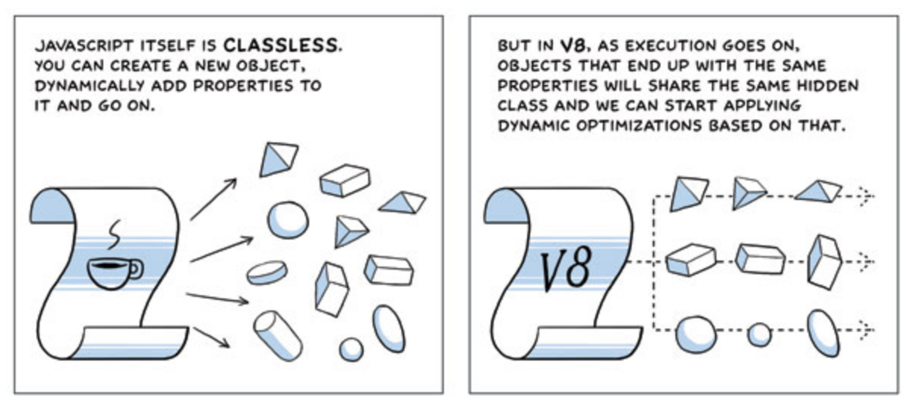

# 16장

## 자료구조 Map

Map(맵)은 키가 있는 데이터를 저장한다는 점에서 `객체`와 유사해보인다. 하지만 Map은 키에 다양한 자료형을 허용한다는 점에서 차이가 있다.

Map에는 다음과 같은 주요 메서드와 프로퍼티가 있다.

-   new Map() – 맵을 만듭니다.
-   map.set(key, value) – key를 이용해 value를 저장합니다.
-   map.get(key) – key에 해당하는 값을 반환합니다. key가 존재하지 않으면 undefined를 반환합니다.
-   map.has(key) – key가 존재하면 true, 존재하지 않으면 false를 반환합니다.
-   map.delete(key) – key에 해당하는 값을 삭제합니다.
-   map.clear() – 맵 안의 모든 요소를 제거합니다.
-   map.size – 요소의 개수를 반환합니다.

```js
const map = new Map()

map.set('name', 'bbakjun')
map.set(28, '28')
map.set(true, 'boolean')

console.log(map.get('name')) // 'bbakjun'
console.log(map.get(28)) // '28'
console.log(map.get(true)) // 'boolean'

console.log(map.size) // 3
```

```js
map['job'] = 'FE' // 이방법은 올바른 방법이아니다.
```

위의 방법은 올바른 방법이 아니다.

`map[key] = value` 로 값을 설정할 수 있지만 이 방법은 map을 일반객체처럼 취급하게 된다.<br/>
map을 사용할때에는 map 전용 메서드인 get set을 사용해야한다.

map에는 객체를 키로 사용할 수 있다는 점이 map의 가장 중요한 기능중 하나다.

```js
const bbakjun = { name: 'BBAKJUN' }

const map = new Map()

map.set(bbakjun, 28)

console.log(map.get(bbakjun)) // 28
```

#### map이 키를 비교하는 방식

맵은 SameValueZero라 불리는 알고리즘을 사용해 값의 등가 여부를 확인한다. 이 알고리즘은 일치 연산자 `===`와 거의 유사하지만 NaN과 NaN을 같다고 취급하는것에서 차이가 있다. 따라서 맵에선 NaN도 키를 쓸 수 있다.

#### map 체이닝

map.set은 호출할떄 마다 맵 자신이 반환된다. 이를 활요하면 map.set을 체이닝할수있다.

```js
map.set('1', 'str').set(1, 'num1'), set(true, 'boolean')
```

#### 반복작업이 가능한 맵의 요소

-   `map.keys()`는 각 요소의 키를 모은 이터러블 객체를 반환한다.
-   `map.values()`는 각 요소의 값을 모은 이터러블 객체를 반환한다.
-   `map.entries()`는 요소의 `[키, 값]`을 한 쌍으로 하는 이터러블 객체를 반환한다.

> Map은 삽입순서를 기억한다. Map은 값이 삽입된 순서대로 순회를 실시한다. 객체가 프로퍼티 순서를 기억하지 못하는 것과는 다르다

## 자료구조 Set

set은 집합의 개념과 같다. 중복되지 않는 항목들이 모인것을 set이라고 한다.<br/>
set에는 순서가 없다. 만약 순서가 필요없고 고유값을 원한다면 set이 최선의 자료구조가 된다.

-   new Set(iterable) – 셋을 만듭니다. 이터러블 객체를 전달받으면(대개 배열을 전달받음) 그 안의 값을 복사해 셋에 넣어줍니다.
-   set.add(value) – 값을 추가하고 셋 자신을 반환합니다.
-   set.delete(value) – 값을 제거합니다. 호출 시점에 셋 내에 값이 있어서 제거에 성공하면 true, 아니면 false를 반환합니다.
-   set.has(value) – 셋 내에 값이 존재하면 true, 아니면 false를 반환합니다.
-   set.clear() – 셋을 비웁니다.
-   set.size – 셋에 몇 개의 값이 있는지 세줍니다.

Set내에 동일한 값이 있다면 `set.add(value)`을 아무리 많이 호출하더라도 아무런 반응이 없을것이다. 왜냐하면 Set은 중복허용을 하지 않기 때문이다.

하루에 한번 방문자 방명록을 만든다고 가정해보자. 한 방문자가 여러번 방문하더라도 방명록에는 첫방문시에만 기록이되어야한다. <br/>
위에서 순서가 필요없고 고유값을 원한다면 set이 최선의 자료구조가 된다고 했는데 지금 이 경우가 그런경우가 될 수 있다.

```js
const guestBook = new Set()

const bbakjun = { name: 'bbakjun' }
const BBAKJUN = { name: 'BBAKJUN' }
const ParkJunHyeong = { name: 'ParkJunHyeong' }

guestBook.add(bbakjun)
guestBook.add(BBAKJUN)
guestBook.add(ParkJunHyeong)
guestBook.add(ParkJunHyeong)
guestBook.add(BBAKJUN)
guestBook.add(bbakjun)
guestBook.add(BBAKJUN)

console.log(guestBook.size) // 3

for (let user of guestBook) {
	console.log(user.name) // bbakjun BBAKJUN ParkJunHyeong
}
```

Set대신 Array를 사용하여 방문자 정보를 저장한 후, 중복값 여부는 배열 메서드인 find를 이용해 확인할 수도 있다. 하지만 Array.find는 배열 내 요소 전체를 뒤져 중복 값을 찾기 때문에 Set보다는 성능이 떨어진다.

#### 반복작업이 가능한 맵의 요소

Set에도 Map과 마찬가지로 반복 작업을 위한 메서드가 있다.

-   `set.keys()`는 셋 내의 모든 값을 포함하는 이터러블 객체를 반환한다.
-   `set.values()`는 set.keys와 동일한 작업을 한다. 맵과의 호환성을 위해 만들어진 메서드
-   `set.entries()`는 셋 내의 각 값을 이용해 만든 `[값, 값]`을 한 쌍으로 하는 이터러블 객체를 반환한다. Map과의 호환성을 위해 만들어졌다.

## WeakMap, WeakSet

자바스크립트 엔진은 도달 가능한 값을 메모리에 유지한다.

```js
let user = { name: 'bbakjun' }

// 위 객체는 user라는 참조를 통해 접근이 가능하다.

user = null
// 그런데 참조를 null로 덮어쓰면 위 객체에 더 이상 도달이 가능하지 않게되어 객체가 메모리에서 삭제된다.
```

자료구조를 구성하는 요소도 자신이 속한 자료구조가 메모리에 남아있는 동안에 대개 도달 가능한 값으로 취급되어 메모리에서 삭제되지 않는다.<br/>
객체의 프로퍼티나 배열의 요소, 맵이나 셋을 구성하는 요소들이 이에 해당한다.

```js
let user = { name: 'bbakjun' }

const arr = [user]

user = null

console.log(JSON.stringify(arr[0])) // '{ name: "bbakjun" }'
```

위의 예시에서 user을 나타내는 객체는 배열의 요소이기 때문에 가비지 컬렉터의 대상이 되지 않는다. 따라서 arr[0]을 이용하면 해당 객체를 얻는것이 가능하다.

Map에서 객체를 키로 사용한 경우 역시 Map이 메모리에 남아있는 한 객체도 메모리에 남게된다. 가비지 컬렉터의 대상이 되지는 않는다.

```js
let user = { name: 'bbakjun' }

const map = new Map()
map.set(user, '...')

user = null

for (let obj of map.keys()) {
	console.log(JSON.stringify(obj)) // '{ name: "bbakjun" }'
}

console.log(map.size) // 1
```

이런 관점에서 WeakMap과 일반 Map은 전혀 다른 양상을 보인다. WeakMap을 사용하면 키로 쓰인 객체가 가비지컬렉션의 대상이 된다.

#### WeakMap

맵과 위크맵의 첫번째 차이는 위크맵의 키는 반드시 객체여아 한다는 점이다. 원시값은 위크맵의 키가 될 수 없다.

```js
let user = { name: 'bbakjun' }

const weakMap = new WeakMap()
weakMap.set(user, '...')

user = null
```

user은 나타내는 객체는 오로지 위크맵의 키로만 사용되고 있으므로 참조를 덮어쓰게 되면 이 객체는 위크맵과 메모리에서 자동으로 삭제된다.

위크맵은 맵보다 제공하는 메서드가 적다.

-   weakMap.get(key)
-   weakMap.set(key, value)
-   weakMap.delete(key)
-   weakMap.has(key)

왜 이렇게 적은 메서드만을 제공하는걸까 ?

원인은 가비지 컬렉션의 동작 방식 때문이다. 위 예시에서 user을 나타내는 객체처럼, 객체는 모든 참조를 잃게되면 자동으로 가비지 컬렉션의 대상이 된다. 그런데 가바지 컬렉션의 동작 시점은 정확히 알 수 없다.

가비지 컬렉션이 일어나는 시점은 JS 엔진이 결정한다. 객체는 모든 참조를 잃었을 떄, 그 즉시 메모리에서 삭제될 수 도있고, 다른 삭제 작업이 있을 때까지 대기하다가 함께 삭제될 수도 있다. 위크맵에 키로 객체를 설정해주고 객체의 참조를 잃게한다면 현재 위크맵에 요소가 몇 개 있는지 정확히 파악하는것 자체가 불가능한 것이다. 가비지 컬렉터가 한번에 메모리를 청소할 수 도있고, 부분 부분 메모리를 청소할 수도 있으므로 위크맵의 요소 전체를 대상으로 무언가를 하는 메서드는 동작 자체가 불가능하다.

그럼 어떤 경우에 위크맵을 사용할수 있는가?

#### 유스케이스: 추가 데이터

위크맵은 부차적인 데이터를 저장할 곳이 필요할떄 유용하다.

아래에 사용자 방문 횟수를 세어주는 코드가 있다. 관련 정보는 맵에 저장하고 있고 맵 요소의 키에는 특정 사용자를 나타내는 객체를, 값에는 해당 사용자의 방문 횟수를 저장하고 있습니다. 어떤 사용자의 정보를 저장할 필요가 없어지면(가비지 컬렉션의 대상이되면) 해당 사용자의 방문 횟수도 저장할 필요가 없어진다.

```js
const visitsCountMap = new Map() // 사용자의 방문 횟수를 저장할 맵

// 사용자가 방문하면 방문횟수를 늘려준다.
const countUser = (user) => {
	const count = visitsCountMap.get(user) || 0
	visitsCountMap.set(user, count + 1)
}

let bbakjun = { name: 'bbakjun' }

countUser(bbakjun) // bbakjun의 방문 횟수를 증가시킨다

// bbakjun의 방문 횟수를 셀 필요가 없다면 아래와 같이 bbakjun의 참조를 null로 끊어낸다
bbakjun = null
```

bbakjun을 나타내는 객체는 가비지 컬렉션의 대상이 되어야하는데 visitsCountMap의 키로 사용되고있어서 메모리에서 삭제 되지않는다.

특정 사용자를 나타내는 객체가 메모리에서 사라지면 해당 객체에 대한 정보도 손수 지워줘야하는 상황이다. 이렇게 하지않으면 visitsCountMap가 차지하는 메모리 공간이 한없이 커질것이다. 애플리케이션의 구조가 복잡할때에는 이렇게 쓸모없는 데이터를 수동으로 비워줘야하는게 골치가 아플수도 있다.

```js
const visitsCountMap = new WeakMap() // 사용자의 방문 횟수를 저장할 위크맵

const countUser = (user) => {
	const count = visitsCountMap.get(user) || 0
	visitsCountMap.set(user, count + 1)
}
```

위크맵을 사용하면 visitsCountMap을 수동으로 청소해줄 필요가 없다. bbakjun을 나타내는 객체가 도달 가능하지 않은 상태가 된다면 자동으로 메모리에서 삭제되기 때문이다. 위크맵의 키에 대응되는 값도 자동으로 가비지 컬렉션의 대상이된다.

#### WeakSet

WeakSet은 Set과 유사한데 객체만 저장할 수 있다는 점이 다르다.

Set안의 객체는 도달 가능할 때만 메모리에서 유지된다.

Set과 마찬가지로 WeakSet이 지원하는 메서드는 단촐하다 `add`, `has`, `delete`를 사용할 수있고 `size`, `keys()`나 반복 작업 관련 메서드는 사용이 불가능하다.

WeakMap과 WeakSet의 가장 큰 단점은 반복 작업이 불가능하다는 점이다. WeakMap과 WeakSet에 저장된 자료를 한 번에 얻는게 불가능하다. 이런 단점은 불편해보이지만 WeakMap과 WeakSet을 이용해 할 수 있는 주요 작업을 방해하지는 않는다. WeakMap과 WeakSet은 객체와 함꼐 추가 데이터를 저장하는 용도로 쓸 수 있다.

# 17장

17장은 Array.includes 메서드와 지수연산자에 대해 간단하게 눈으로 학습만하고 스킵했습니다.

# 18장

## Object.keys values entries

이 메서드들은 포괄적인 용도로 만들어졌기 때문에 메서드를 적용할 자료구조는 일련의 합의를 준수해야한다고한다. 커스텀 자료구조를 대상으로 순회를 해야한다면 이 메서드들을 사용하지 못하고 직접 구현해야한다.

이 메서드들을 사용할 수 있는 자료구조는 아래와 같다

-   Map
-   Set
-   Array

일반 객체에도 순회관련 메서드가 있는데 문법에 차이가 있다.

일반 객체엔 다음과 같은 메서드 사용이가능하다.

-   Object.keys(obj) : 객체의 키만 담은 배열을 반환한다.
-   Object.values(obj) : 객체의 값만 담은 배열을 반환한다.
-   Object.entries(obj) : 객체의 키와 값을 쌍으로 담은 배열을 반환한다.

`Map, Set, Array`의 전용 메서드와 일반 객체용 메서듸 차이를 비교하면 아래와 같다.

```js
const map = new Map()

map.set('name', 'bbakjun')
map.set('age', 28)
map.set('job', 'FE')
map.set('school', 'MJ')

console.log(map.keys()) // MapIterator {'name', 'age', 'job', 'school'}

const jun = {
	name: 'bbakjun',
	age: 28,
	jog: 'FE',
	school: 'MJ',
}

console.log(Object.keys(jun)) // ['name', 'age', 'jog', 'school']
```

Map,set,Array의 메서드의 반환값은 이터러블 객체를 반환하고, 일반 객체의 메서드 반환값은 배열을 반환한다는것을 알 수 있다.

첫번쨰 차이는 jun.keys()가 아닌 Object.keys(obj)를 호출 한다는 점이다.

이렇게 문법이 다른 이유는 유연성 떄문이다. 자바스크립트는 복잡한 자료구조 전체가 객체에 기반하기때문이다.(프로토타입 체이닝이 객체에 걸려있기 때문) 그러다보니 객체 data에 자체적으로 data.values()라는 메서드를 구현해 사용하는 경우가 있을 수 있다. 이렇게 커스텀 메서드를 구현한 상태라도 Object.values(data) 같은 형태로 메서드를 호출할 수 있으면 커스텀 메서드와 내장메서드 둘다를 사용할수있다.

두번쨰 차이는 Object.\*를 호출하면 이터러블 객체가 아닌 객체의 한 종류인 배열을 반환한다는 점이다. 진짜 배열을 반환하는 이유는 하휘 호환성 때문이다.

> Object.keys values entries는 심볼형 프로퍼티를 무시한다.

`for...in` 반복문처럼 위의 메서드는 키가 심볼형인 프로퍼티를 무시한다.

대개는 심볼형 키를 연산 대상에 포함하지 않는게 좋지만 심볼형 키가 필요한 경우엔 심볼형 키만 배열 형태로 변환해주는 메서드인 Object.getOwnPropertySymbols를 사용하면 된다.

# 19장

## async await

async와 await을 사용하면 프라미스를 좀 더 편하게 사용할 수 있다.

### async

async 키워드는 function 앞에 위치한다.

function앞에 async 키워드를 붙이면 해당 함수는 항상 프라미스를 반환하게된다. 프라미스가 아닌 값을 반환하더라도 이행 상태의 프라미스(resolved Promise)로 값을 감싸 이행된 프라미스가 반환된다.

```js
async function sayHello() {
	return 'hello'
}

sayHello().then((res) => console.log(res)) // 'hello'
```

async가 붙은 함수는 반드시 프라미스를 반환하고, 프라미스가 아닌것도 프라미스로 래핑해 반환한다.

### await

```js
// await은 async 함수 안에서만 동작한다
const value = await promise
```

자바스크립트는 await 키워드를 만나면 프라미스가 처리될 때까지 기다린다. 결과는 그 이후 반환된다.

```js
async function f() {
	let promise = new Promise((resolve, reject) => {
		setTimeout(() => resolve('완료!'), 1000)
	})

	console.log('함수이전')
	let result = await promise // 프라미스가 이행될 때까지 기다림 (*)
	console.log('함수이후', result)
}

f()
```

함수를 호출하고 함수 본문이 실행되는 도중 (\*)로 표시한 줄에서 실행이 잠시 중단되었다가 프라미스가 처리되면 실행이 재개된다.

await는 말 그대로 프라미스가 처리 될 때까지 함수 실행을 기다리게 만든다. 프라미스가 처리되길 기다리는 동안에 다른일(다른 스크립트 실행, 이벤트 처리 등)을 할 수 있기 때문에, CPU리소스가 낭비되지 않는다.

await는 promise.then보다 좀 더 간편하게 result값을 얻을수 있도록 하는 문법이다.

> await은 최상위 레벨 코드에서 작동하지 않는다.

```js
// 최상위 레벨 코드에선 에러 발생
const res = await fetch('/api/v1/user.json')
const user = res.json()
```

```js
// 익명 async 함수로 코드를 감싸면 최상위 레벨 코드에서도 사용이 가능하다.
;(async () => {
	const res = await fetch('/api/v1/user.json')
	const user = res.json()
})()
```

await은 `thenable`객체를 받는다.

promise.then처럼 await에도 thenable객체를 사용할 수 있다. thenable 객체는 서드파티 객체가 프라미스가 아니지만 프라미스와 호환가능한 객체를 제공할 수 있다는 점에서 생긴 기능이다. 서드파티에서 받은 객체가 .then을 지원하면 이 객체를 await과 함께 사용할 수 있다.

[thenable 객체](https://masteringjs.io/tutorials/fundamentals/thenable)는 해당링크에 잘 정리되어있다.

#### 에러 핸들링

프라미스가 정상적으로 이행되면 await promise는 프라미스 객체의 result에 저장된 값을 반환한다. 프라미스가 거부되면 마치 throw 문을 작성한 것 처럼 에러가 던져진다.

```js
async function fn() {
	await Promise.reject(new Error('에러 발생!'))
}

async function fn() {
	throw new Error('에러 발생!')
}
```

실제 상황에선 프라미스가 거부 되기 전에 약간의 시간이 지체되는 경우가 있다. 이경우 await가 에러를 던지기 전에 지연이 발생한다.

await이 던진 에러는 throw가 던진 에러를 잡을때처럼 try catch를 사용하면된다

```js
async function fn() {
	try {
		const res = await fetch('/잘못된 엔드포인트/user.json')
		const user = res.json()
	} catch (error) {
		console.log(error) // 에러 발생
	}
}
```

# 20장

## 객체에 스프레드 문법 사용

```js
const apple = {
	name: '사과',
}

const redApple = {
	name: '사과',
	color: 'Red',
}

const sweatRedApple = {
	name: '사과',
	color: 'Red',
	taste: 'Sweat',
}
```

위의 코드로 스프레드 연산자가 언제 사용되는지 알아보겠다.

이 코드에서 가장 먼저 apple이라는 객체를 선언한 후 redApple, sweatRedApple 이라는 객체를 만들었다. 기존에 선언한 apple은 건들이지 않은채 apple이 가지고 있는 값을 그대로 사용했다.

위 코드의 핵심은 기존의 것은 건들이지 않고 새로운 객체를 만든다는것인데 이럴때 아래의 코드처럼 spread문법을 사용하면 유용하다

```js
const apple = {
	name: '사과',
}

const redApple = {
	...apple,
	color: 'Red',
}

const sweatRedApple = {
	...redApple,
	taste: 'Sweat',
}
```

내친김에 얕은복사와 깊은복사까지 알아보도록해보겠다

-   얕은복사 : 객체의 1depth 까지만 복사한다.
-   깊은복사 : 객체에 중첩된 객체까지 모두 복사한다.

얕은 복사를 하면 한단게만 복사하기 때문에 중첩된 객체에 대해서는 서로 영향을 주고, 깊은 복사는 중첩된 객체 역시 별개의 값으로 서로 영향을 주지 않는다.

### 원시값의 불변성

원시값(primitive)은 변경 불가능한 불변의 값이다.(string, number, undefined, boolean, symbol, bigint)

변수 값이 변경되는것을 원시값이 변경된다고 생각하면 안된다.

변수는 값을 담고 있는 메모리 공간 자체 또는 그 메모리 공간의 주소를 가리키는 식별자이다. 변수에 값이 할당되면 실제로는 메모리 공간에 값이 담기고 변수는 그 메모리 주소를 가리킨다.

```js
// 주소 : 0x000000F2, 값 : undefined
let variable
// 주소 : 0x00001234, 값 : 100
variable = 100
```

위의 코드처럼 원시값이 undefined나 100은 변경 불가능하므로 원시값을 재할당한다. 재할당은 새 메모리 공간을 확보하고 값을 저장한 후 변수가 참조하던 메모리 주소를 변경함으로써 이루어진다. 이래서 원시값은 불변성을 유지하고 변수는 가리키는 메모리 주소를 바꿔가며 변수 값을 변경한다.

> 상수와의 차이는 상수는 변수의 재할당이 금지된것으로 원시값이 불변성을 자기는것과는 의미가 다르다.

#### 원시값의 copy

```js
// 주소 : 0x000000F2, 값 : 'origin'
let origin = 'origin'

// 주소 : 0x00001234, 값 : 'origin'
let copyFromOrigin = origin

origin = 'origin2'

console.log(copyFromOrigin) // 'origin'
```

원시값을 갖는 변수를 다른 변수에 할당하면 값은 그대로 복사되지만 같은 값을 가지느 별개의 메모리 공간을 가리킬뿐이다.<br/>
따라서 각 변수에 어떤 짓을 하던 서로에게 영향은 줄 수 없다.

#### 객체

원시값과 달리 객체는 변경이 가능한 값이고 속성들의 집합이다. 자바스크립트는 객체 생성 이후에도 프로퍼티를 추가하거나 삭제하는 등 변경이 가능하다.

데이터가 동적으로 추가되면 선언 당시의 프로퍼티 데이터 타입이나 순서가 프로퍼티에 접근할 때와는 달라질 수 있기 때문에 프로퍼티 값을 읽을 때마다 프로퍼티를 찾아야한다. v8에서는 객체의 동적 변경으로 인한 프로퍼티 접근 비용을 낮추기 위해 [히든 클래스](https://engineering.linecorp.com/ko/blog/v8-hidden-class/)를 사용한다.

> 히든 클래스 : 객체의 기존 프로퍼티로부터의 메모리 오프셋을 갖고있어 변경된 프로퍼티를 찾을 수 있다. 이전 히든클래스는 변경사항이 적용되면 다음 클래스로 전환된다는 정보를 추가한다.



#### 객체 값을 갖는 변수는 객체의 메모리 주소를 참조한다.

```js
/*
    주소          값
    0x000000F2   0x00001234
    0x00001234   { name : 'this is originName' }
*/
const origin = {
	name: 'this is originName',
}
```

객체 값을 갖는 변수가 가리키는 메모리 공간에는 객체가 아닌 객체의 메모리 주소값이 들어가게 된다.

따라서 객체가 변경되어도 변수의 객체 값에 대한 메모리 주소는 변경되지 않고 항상 객체를 참조할 수 있다.

객체는 원시값처럼 크기가 일정하지도 않고 프러퍼티 값이 객체인 경우 복사해서 생성하는 비용이크고 메모리 공간도 많이 차지하기 때문에 원시값처럼 할당할 때 마다 생성하지않고 참조해서 사용한다.

```js
const user = {
	name: 'BBAKJUN',
	job: {
		name: 'FE',
		detail: {
			name: 'Frontend Engineer',
		},
	},
}
const copyUser = { ...user }

console.log(user === copyUser, user.job === user.job) // false, true
```

객체 리터럴 사용시 항상 객체를 생성하기 때문에 객체 자체는 다른것으로 평가되나 내부에 중첩된 객체는 같은것으로 평가된다.

객체가 저장된 주소를 복제하는것을 얕은복사(shallow Copy)라고 한다.

주소를 복제한느것이 아닌 다른 메모리에 객체를 똑같이 복제하고 싶다면 깊은 복사(deep Copy)를 해야한다. 변수명을 복제하는 것이 아닌 객체에 속한 모든 내용을 복제해야한다. 이때 객체 프로퍼티에 참조값이 저장되어 있는 부분을 주의해 복제를 진행해야한다.<br/>
깊은 복사를 진행하는경우 프로퍼티의 값이 원시형일 경우 그대로 복사를 진행하고 참조값일 경우에는 레퍼런스 주소 내부의 값을 복제해 진행하면 된다.

> 자바스크립트에서 깊은복사를 하는 방법에는 대표적으로 재귀함수를 사용하는 방법과 JSON 객체를 사용하는 방법이 있다.

```js
// 재귀함수 사용
let origin = {
	a: 1,
	b: { c: 2 },
}

function isCopyObj(origin) {
	let res = {}

	for (let key in origin) {
		if (typeof origin[key] === 'object') {
			res[key] = isCopyObj(obj[key])
		} else {
			res[key] = origin[key]
		}
	}

	return res
}

let copy = isCopyObj(origin)

copy.b.c = 3
console.log(origin.b.c === copy.b.c) //false
console.log(origin.b.c, copy.b.c) // 2 3

// JSON 객체 사용
let origin = {
	a: 1,
	b: { c: 2 },
}

let copy = JSON.parse(JSON.stringify(origin))
copy.b.c = 3

console.log(origin.b.c === copy.b.c) //false
```

> JSON객체를 사용하는 방법이 완벽한 깊은복사는 할수라고 없다

[JSON](https://developer.mozilla.org/en-US/docs/Web/JavaScript/Reference/Global_Objects/JSON)이 가질수있는 데이터 타입은 `Object`, `Array`, `Number`, `String`, `Boolean`, `Null` 총 6가지다.

자바스크립트가 제공하는 데이터타입을 포함은 하지만 포함하지 않는 데이터 타입을 JSON객체를 사용하여 복사할 수 없기때문이다


**JSON이 지원하지 않는 데이터타입은 일반 객체 리터럴로 파싱을 해버리기 때문에 불완전한 깊은복사라고 할수있다**

### Promise then catch finally

#### Promise란?

`Promise`는 비동기 작업이 맞이할 미래의 완료 또는 실패 그 결과 값을 나타낸다

-   매개변수 : executor 함수를 받는다
    -   executor는 resolve, reject 인수를 전달받는다.
    -   resolve, reject는 함수로써 호출되면 promise를 이행하거나 거부한다. 이 둘을 이용해 비동기 작업이 완료되면 resolve를 호출해 이행하고, 도중에 에러발생시 reject를 호출해 거부를 한다.
-   상태
    -   pending : 대기 상태로 초기의 상태이다.
    -   fullfilled : 이행 상태로 연산이 성공한 상태
    -   rejected : 거부 상태로 연산이 실패한 상태

#### Promise.then

프라미스가 종료되면 resolve(이행)에 들어간 값을 받을 수 있다.

#### Promise.catch

프라미스가 종료되면 reject(거부)에 들어간 값을 받을 수 있다.

> 보통 catch를 then뒤에 쓰기때문에 then 이후에 catch가 실행된다고 생각할수있지만 그런게아니라 resolve시에는 then을 실행 reject시에는 catch를 실행 되는것이다

#### Promise.finally

finally는 프라미스가 resolve(이행) 되던 reject(거부)되던 상관없이 지정된 코드를 실핸한다.
