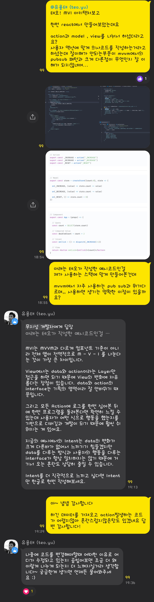
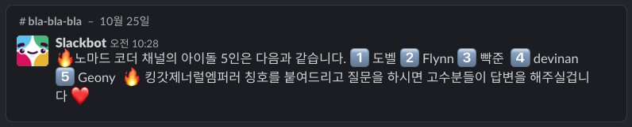
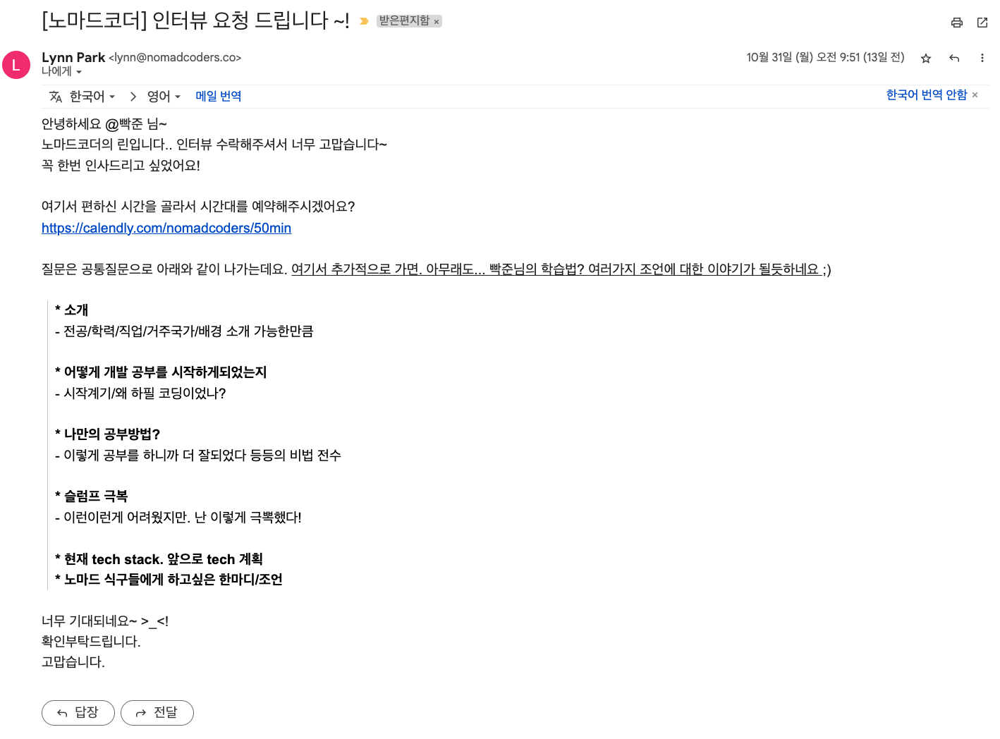
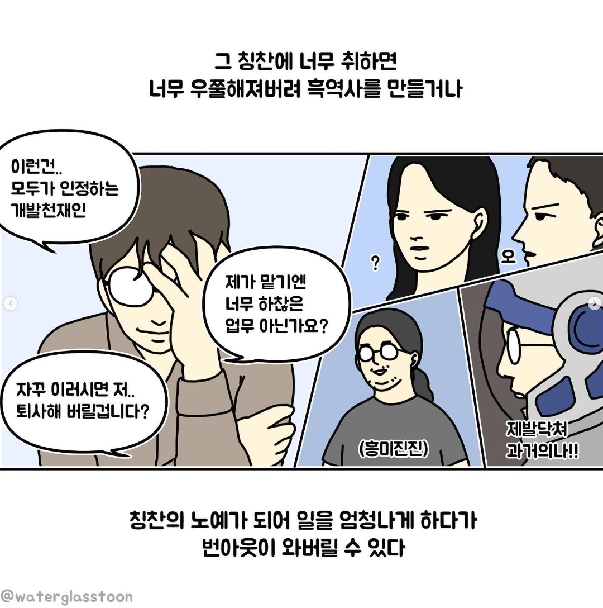

## 무슨 2022년 회고를 벌써하냐? 이놈아?

하지만 10월 말 부터 11월 초인 현재까지 2022년중 개발자 박준형에게 가장 많은 일이 오고가고있다.

한번 읽어주면 감사하겠다

### 노마드코더에서 인터뷰를 해보았다.

우선 노마드코더에서 인터뷰요청을 받게된 배경부터 설명이 필요할거같다.

3월에 현재 회사에 합류하여서부터 개발자 커뮤니티에 관심이 가게되었다. 
이유는 다양한데, 내 주변에 프론트엔드 개발자가 적기 때문이었다..ㅋㅋㅋㅋ

전공자와 비전공자 사이에 있는 정보통신공학과 졸업생은 주변에 개발자가 매우 많다.
다양한 개발자들이 존재하는데

-   웹 백엔드 개발자
-   웹 프론트엔드 개발자
-   안드로이드 개발자
-   데브옵스 개발자

이중 웹 프론트엔드 개발자는 나포함 2명뿐이다. (너무 슬픔~) 
근데 전공수업을 따라가다 보면 자연스레 웹 백엔드 쪽으로 많이 쏠리게 되는 영향도 있긴하다.

그러한 이유로 나는 나와 비슷한 연차 혹은 주니어 프론트엔드 개발자가 많은 커뮤니티에서 생각과 고민을 공유하며 받고싶어 
`노마드코더`, `테오의프론트엔드` 라는 두곳에서 질문을하며 타인의 질문에 답변을 해보고있다.

테오의 프론트엔드 오픈카톡방에는 시니어 프론트엔드 개발자 테오가 주도하는 오픈카톡 + 디스코드 라서  
테오가 블로그 글올린것에대한 질문이 매우 편안하다! 최근에 MVI 패턴을 프론트엔드 적용시키는 글을 올리셔서 바로 작성해보았었다.

이런 점에서 테오의프론트엔드에서 질문하는 경험은 내 인사이트를 늘려주는 창구로써 활용하기가 아주 좋았다.

##### 그렇다면 노마드코더에서는 무엇을 했을까?

노마드코더에는 이제 막 개발공부를 시작하는 뉴비들이 매우 많았다. 
그래서 나도 답변이 가능한것도 많았었고, 그렇게 답변을 달아보기 시작했었다.

하나 둘,, 답변을 시작해보니 아?? 취업은 했지만 모자라는 부분이 계속해서 보이게 되었다.

그렇게 다시 또 하나 둘 답변을 달아보며 내가 아는부분을 설명하며, 진짜 아는 개념인지 확인을 해볼수있었다. 
물론 모르는 개념은 다른분들의 답변을 보며 습득하고있다.

보통 리액트채널과 자바스크립트 채널에서 답변을 주고 받는데, 
가장 힘든 질문은 리액트 라우터 돔에 관련된 질문이었다.  
왜냐면 나는 Next.js로만 개발을 진행하고있기에 react-router-dom 은 취준때에 v4 or v5버전만 사용해보았기에 답변이 너무 어렵더라 ㅋㅋ

아무튼 이렇게 답변을 주고 받고 하다보니 아이돌이 되었다.... ㅋㅋㅋㅋㅋㅋㅋㅋㅋㅋㅋㅋㅋㅋㅋㅋㅋㅋㅋㅋㅋ

나도 나 좋자고 한일에 이런 칭호(?)를 얻으니 부끄러워졌었는데, 칭호를 주시니 정말 감사했다.

개인적으로 도벨, Flynn님들은 나 취준떄에도 질문을 올리면 답변을 주시던 너무 감사하던 분들인데 그분들의 뒤에 내가있다니,,,, 말이 안될정도로 쑥스럽다!

최근 노마드코더 관계자이신 Dori님께 DM을 받았다. 
인터뷰를 진행해보고 싶다고 하셨다. (어?? 내가 그정도는 절대 아닌데?? 왜지? 라는 마음에 인터뷰에 응해버렸다 ㅋㅋㅋ)

위와같이 메일을 받고 그다음주인 2022/11/08 인터뷰를 진행했다.

인터뷰라고 해서 면접같은 분위기인가?라는 생각으로 처음 시작은했지만, Lynn 님과 수다를 떠는 커피챗같은 시간이었다. ㅋㅋㅋㅋㅋ  
아주 재밌었다. 나의 학부시절과 웹개발을 언제 시작했었는지 부터해서 멋쟁이사자처럼 4기활동까지 신나게 떠들어보았었다 !

자세한 내용은 추후에 노마드코더 인터뷰 섹션에서 확인하면 될것같다.

인터뷰 상품으로 (노마드후디 / 아마존 기프트 카드) 둘중에 나는 노마드 후디로 정했다

후드티는 못참지~~

### 이직을 해볼까 라고 조금은 고민이 생겼다.

위짤과 같이 자만, 오만에서 오는 이직 뽕이 아님을 말하고싶다.

그러면 무슨 의미에서 갑자기 이런 선택을 했는가? 라고 묻는다면,
사실 대학동기 `Ayaan(이현호)`놈이 내가 가고싶어했었던 회사의 공고가 올라왔다고 공유해주었다.

그래서 지금 다니는곳도있지만, 좋은기회가 있을때에 한번 지원해보는것이 나중에 후회가 없을것같아 지원을 해보았고,

서류 합격부터 사전과제 까지 통과를 해보았다.  
좋은 기회를 잡은 만큼 최선을 다해보고 최종합격후 다시한번 회고를 작성해보겠다 ㅎㅎ

(합불을 떠나 사전과제의 퀄리티가 아주 만족스러웠다..! 프론트엔드 개발자가 이해해야하는 Document를 알기에 너무 좋은 3일이었던것같다)

#### 참고문헌

> 인스타(데브경수) : https://www.instagram.com/p/Cii8yTRvq2t/
