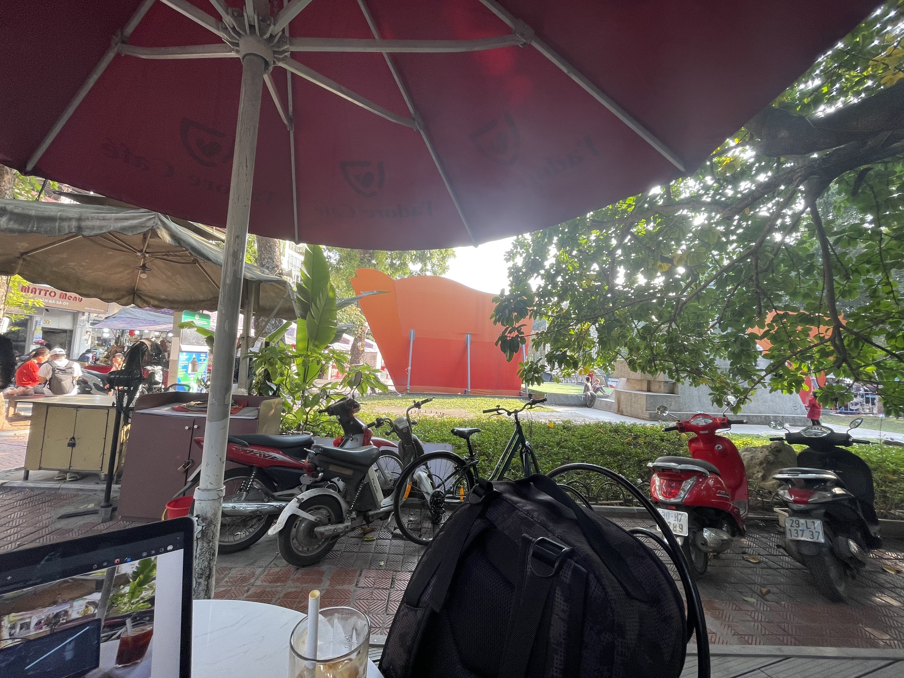
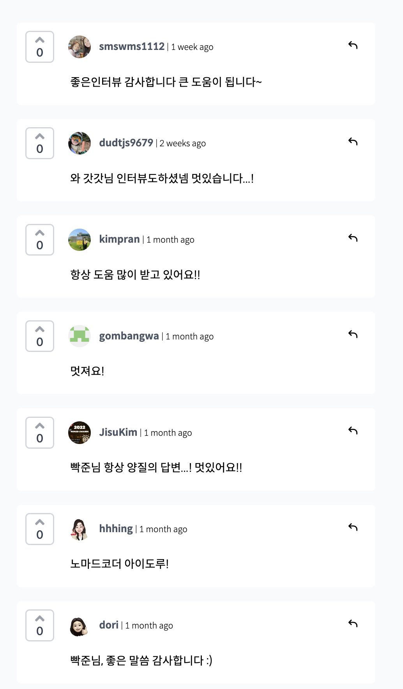

# 나는 지금 하노이에 있다.

가족여행으로 23일부터 25일까지 베트남 하노이에 여행을 왔다.
아침에 부모님과 동생은 10시 35분 비행기를 타고 한국으로 떠나셨다.

점심을 먹고 호안끼엠 호수 근처의 와이파이가 가능한 카페를 간신히 찾아서 지금 막 회고글을 작성하고있다. ㅋㅋㅋㅋ`(커피는 정말 맛이없다.)`

개발자를 시작하고나서 외국에서 글 한번 작성해보는게 내 로망(?)이었다. 
사실 나도 아침에 부모님과 같이 한국으로 갈 수 있었지만, 이런 로망은 혼자 있을때에만 가능하기에 한번 밤출발하는 비행기 티켓을 끊는 객기를 부려보았다...(?)

지금 베트남은 되게 날씨가 좋다..! 평균최고기온이 23~24도라 너무너무 맘에든다.

## 2022년에는 난 무엇을했는가

이제 회고를 시작해보겠다.

### 2021년 8월부터 3월 초 까지

2021년 8월에 학생인턴으로 입사했던 송도의 모기업에서 5개월간 인턴으로 일하고,  
내가 꿈꾸던 프론트개발자가 될 수 있게다라는 확신이없어 겁도없이 2022년이 되자마자 바로 퇴사를하고, 
3개월간 그동안 모아뒀던 350만원으로 3개월간 존버하며...(150만원은 월세라 사실상 200만원으로 버틴셈이다)

학부에서 가르쳐주던 강의에서는 웹개발에 관련한 강의가 없다고 생각했엇던 21년~22년 초의 박준형은 무작정 강의를 듣기시작한다.

`프론트엔드개발자`가 되기위해 노마드코더 코코아톡클론, 리액트마스터 강의와, 조현영(제로초)님의 노드버드 리액트 강의를 들으며 무작정 남의 코드를 따라하기 시작한다.

무작정 코드만 따라치다보니, 이게 내가 개발한게 맞을까? 그냥 상품설명서 보고 만든 레고와 다를게 무엇일까를 2월쯤부터 생각 해보았다. 하지만 시간은 촉박했고 강의를 들으며 매일 커밋을 하기위해 노력 했지만 의미있는 커밋만 남기자라고 생각해서 1일 1커밋은 거의 실천하지 못했다. 하지만 주 20커밋은 한것 같다.

그렇게 이제는 기업에 지원을 해봐야겠다라는 생각으로 지원서를 날렸다.

대략 40군데에 지원을하여, 서류합격은 8곳을 하게 되었었다. 그렇게 처음 면접보았던곳은 CRM? 이 도메인 이었던곳 이었는데 앵귤러를 쓴다고 했었다.

사실 `앵귤러`를 쓰는데 `리액트` 밖에 못해서 떨어진게 아니라고 생각한다. 전체적으로 나는 너무 부족한상태였다.  
이때 느꼈던것이 `아는것`과 `알고있어서 남에게 설명할 수 있는것` 이 두가지의 차이가 상당히 크다는것을 느꼈다.

그래서 더 면접 준비를 더했고, 비전공자에게 설명할때와 개발직군에게 설명할때 둘다 생각하며 항상 공부를해오고있다.
그렇게 현재 회사 세진마인드에 합류하게 되었다.

### 3월

나는 3월 14일에 합류하게 되었다. 내가 면접봐서 처음 온 회사고, 같이 일할 수 있는 프론트엔드개발자가 한분 더 있다는 사실에 너무 좋았었다.

원래 한주 전에 입사 할 수 있었는데, 사내에 코로나 역병이 도는 바람에 일주일 연기되어서 14일 합류하게되었다.

3월은 상당히 어지러웠다. 
처음 해보는 환경세팅과, 서비스 설명부터 브랜치전략과 사내스택과 아키텍처로 만들어보는 토이프로젝트까지 많이 바빳다.

### 4월~6월

그렇게 입사한지 한달이 지나 4월이 되었다.

튜토리얼은 끝났고 나도 `PIIP Intranet 프로젝트`에 참여하게 되었고, 나는 사수에게 도움을 받아가며 많은 성장을 했다고 생각한다.

계층간의 분리가 왜 필요하며, 왜 계층간 분리를 하며 개발해야하는지를 알려주셨다.
그렇게 또 정신없이 배워가는 4월이 되었고 또 같은 생활을 반복하며 6월까지 지나갔다.

### 7월

드디어 내가 코로나에 걸렸다.🥶

토요일부터 잔기침과 콧물이 많아졌고 월요일 아침에 출근하고 팀원에게 슬랙으로 코로나 걸리면 어떠냐고 물어보니 내 증상과 완벽하게 일치했다. 잔기침과 콧물 기운없는? 그런증세.

그렇게 바로 회사 근처 병원에 가보니 코로나 확진자가 되었다.

바로 퇴근해서 집에 갈때까지는 엄청아프지 않았다. (그냥 오~ 별로 안아프네? 역시 난 건강한건가? 라는 생각)

하지만 오후두시가 되니 점점 기운이 없어졌다. 그냥 손가락에 힘도안들어고, 정신도 없고 도저히 코드가 보이질않았다.

쳐내야할 피쳐가 눈앞에있는데, 백신 맞았던 밤과 똑같이 오한증세가 와서 너무 힘들었다.

그렇게 하룻밤을 보내고나니 말끔히나았다?  
콧물과 기침은 사라지지 않았지만 몸살기운은 사라져서 다시 일 할 수 있게 되었다.

이때 테오의 스프린트를 모집한다는 소식에 바로 참여했다. 
(스프린트는 매일밤 11시부터 새벽2~3시까지 진행했다. 코로나 격리로 재택이 되어서 오히려 참여하기가 매우 편했다)

참여자마다 주제를 하나씩 생각해오라 해서 `남에게 자랑할만한 내 레포지토리`라는 주제를 생각해서 갔는데, 의도치 않게 내 주제가 두팀중 한팀의 주제가 되었다.

그렇게 `MO:RE`라는 팀이 탄생되었고 루프, 우디, 홍, 래래, 매직타로, 하마와 나(Jay)가 참여했다.

첨보는 사람들과 개발 얘기를하며, 무엇을 만들고싶은지 그걸위해 어떻게 풀어내야할지를 고민하는 시간을 가졌다.

여기서 모두에게 도움을많이 받암지만 루프에게 너무 고마웠다. 팀에 백엔드 개발자가 없어 그중 가장 경력이 긴 루프가 백엔드개발을 하겠다고 해주셨고, Strapi를 사용해서 헤드리스 서비스를 만들어주었다.

같은 프론트엔드 개발자로 참여하고싶었겠지만, 모두를 위해 양보하여 백엔드개발을 해주었고, 프론트 환경세팅까지 작업해주셨었다.

그에 보답하기 위해 두번쨰로 경력이 많아버리게된 나(???)는 공통 레이아웃작업과 Oauth작업외에 다른 팀원들의 태스크 관리를 해보았다.

팀원들에게 물어봤던것이 아래 두가지였다.

-   어떤 작업을 하고싶은가?
-   자신있는 작업이 무엇인가?

시간이 부족했기에 (실제 개발 기간은 토요일과 일요일이었다.) 
먼저 말한 팀원에게 원하는 페이지를 맡기고, 부족하거나 질문이 있다면 부담없이 물어봐달라고 했었다.

우리의 귀하신 디자이너 래래가 피그마로 공유해준 Global Layout을 작성하게 되었고, 로그인페이지까지 만들며 팀원들에게 내가 작성한 레이아웃 내에서 개발을 하도록 공유했었다.

그렇게 아침 10시부터 자정까지 이틀간 코딩해보니 정말 힘들었지만 뿌듯했다. 
(회사에서도 이렇게 못하는데..)

이미 쌓여올려진 블럭에서 블럭을 올리는건 쉽지만, 처음부터 블럭을 쌓을 수 있는 환경을 만들어내는것도 많은 힘이 필요하다는것을 새삼느꼈었다.

그렇게 우리의 프로젝트는 성공적으로 테오의 프론트엔드 오픈톡방에 공유되었고, 뿌듯한 경험이 되었다.

### 8월 ~ 11월

다시 현실로 돌아와 PIIP Intranet 프로젝트에서 기능 개발이 끝날 때마다 qa 테스트를 진행했고, 수많은 오류를 접하게 되었다 ㅠㅠ

확장성을 고려하지않고 당시의 조건을 맞추기위한...

총 3가지의 상태에 따른 20가지의 ui가 보여야하는 페이지는  
이제는 작성한 나조차 재작성하기 두려운 spaghetti code가 되어버렸다... ㅋㅋㅋㅋㅋ

기획의 변경이 없을거라고 생각하고 작성했었지만, 세상에 절대라는 확신은 없다는것을 경험했던 순간이었다.

상태에 따른 컬럼을 작성하기 위해 1000줄이 넘는 배열안에 객체를 만들었던... 과거의 나

그떄 당시의 박준형에게는 그 코드가 최선이었겠지만, 만 1년 4개월차 박준형에게도 그게 최선일까? 라는 생각이 많이 든다.

많은 개발자들이 과한 추상화를 지양하라한다. 초기코드에 후일을 모두 도모 할 수 없기때문이라고 하는데, 아직은 그 경계가 어디인지 잘 감이 잡히지 않는다.

많이 공부해야겠지..? 그렇다 사실 방법은 있다. 그냥 많이 굴러보고 경험해보면 나름대로의 결과가 나올것이다.

그냥 해봐야겠다.

### 12월

그렇게 이번달인 12월이 오게되었다.

노마드 코더에서 나 나름대로 배우고 지식을 얻기위해 답변을해가며 배우다보니? 인터뷰도 해보고 인상깊은 경험이었다.

부끄럽지만 나 공부하려고 한 행동에 다른 이들이 고마움을 느끼는분들이 있다는 사실에 나 또한 감사함을 느겼다.

그리고 대 이직의 시대에 나도 한번 도전했었다.

면접은 총 네곳을 보았고, 원하는 결과는 얻지못했다....이때 자존감이 많이 상하긴했다...ㅋㅋㅋㅋ

하지만 나의 문제점이 무엇인지를 알게된 경험이기에 존심상해도 괜찮다고 생각한다.

1. 대충아는 개념이 너무많다.
2. 개념은 알고있지만, 상대가 왜 그렇게 생각하냐고 물었을떄에 내 주장을 확실하게 하지못한다.
3. 면접볼때 말이 너무 빠르다(엄아아빠가 맨날 말해주는데 못고침 ㅠ)
4. 자신감이없다.

정말 안좋은 습관은 다 가지고있더라 ㅋㅋㅋㅋ

메타인지라고 부족한게 무엇인지 알기에 더 성장 할 수 있을거라고 생각한다...!

이렇게 2022년 찐 회고를 마칩니다.

<hr/ >

### 회고를 마치며

근데 지금 방금 드는 생각인데, 왜 나는 나를 소개할때에 자랑 혹은 자학하는 생각을 할까 라는 생각을 하고있다.

조금은 낙관적으로 생각하며 행동해야겠다.

내년에는 올해보다 성장한 프론트엔드개발자가 되어야겠다.
